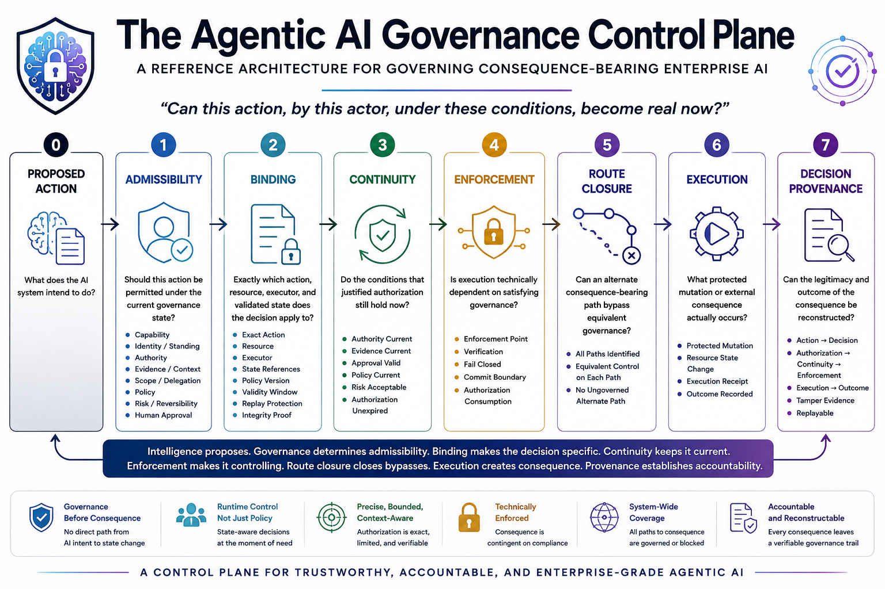

# The Agentic AI Governance Control Plane

### A Vendor-Neutral Reference Architecture for Governing Consequence-Bearing Enterprise AI

> **Can this action, by this actor, under these conditions, become real now?**

---

---


---

## Why This Project Exists

Enterprise AI changes fundamentally when an AI system can do more than generate text.

Once an agent can:

- invoke tools,
- call APIs,
- initiate financial transactions,
- modify enterprise records,
- change permissions,
- trigger workflows,
- interact with other agents,
- or create durable external consequences,

the primary governance problem is no longer only:

> **Was the model's answer correct?**

It becomes:

> **Was this action permitted to become real — by this actor, under the current authority, evidence, policy, risk, and approval state?**

And even that is not enough.

A valid governance decision can still fail if:

- the approved action changes before execution,
- authority expires or is revoked,
- evidence becomes stale,
- approval no longer applies,
- the executor ignores the decision,
- another execution route bypasses governance,
- or the enterprise cannot later reconstruct why the consequence was legitimate.

This repository develops a reference architecture for addressing that problem.

---

# The Core Idea

AI intelligence and execution authority should not be the same thing.

```text
Intelligence
     ↓
Proposed Action
     ↓
Governance
     ↓
Controlled Execution
     ↓
Enterprise Consequence
```

The architecture introduces a runtime control chain between **what an AI wants to do** and **what the enterprise allows to become real**.

```text
Proposed Action
      ↓
Admissibility
      ↓
Binding
      ↓
Continuity
      ↓
Enforcement
      ↓
Route Closure
      ↓
Execution
      ↓
Decision Provenance
```

Each stage closes a different governance gap.

---

# The Runtime Governance Architecture

| Stage | Core Question |
|---|---|
| **Proposed Action** | What does the AI system intend to do? |
| **Admissibility** | Should this action be permitted under the current governance state? |
| **Binding** | Exactly which action, resource, executor, and validated state does the decision apply to? |
| **Continuity** | Do the conditions that justified authorization still hold now? |
| **Enforcement** | Is execution technically dependent on satisfying governance? |
| **Route Closure** | Can an alternate consequence-bearing path bypass equivalent governance? |
| **Execution** | What protected mutation or external consequence actually occurred? |
| **Decision Provenance** | Can the legitimacy and outcome of that consequence later be reconstructed? |

The central architectural principle is:

> **Governance is not merely the decision to allow or deny. Governance is making that decision binding on consequence.**

---

# From Seven Governance Questions to One Architecture

This project grew from a seven-part exploration of enterprise Agentic AI governance.

The questions initially appeared separate:

```text
Wrong Action
     ↓
Authority Drift
     ↓
Control Plane
     ↓
Path Correctness
     ↓
Autonomy
     ↓
Zero Trust
     ↓
Decision Provenance
```

They eventually converged on one systems problem:

> **A governance decision has limited value unless it remains authoritative all the way to consequence.**

That observation led to the **Agentic AI Governance Control Plane**.

---

# Explore the Repository

The repository is organized into three connected layers:

```text
REFERENCE ARCHITECTURE
What control model should exist?
        ↓
SPECIFICATIONS
What invariants and contracts define it?
        ↓
REFERENCE SCENARIO
How do those controls behave end-to-end in practice?
```

Each layer has its own index and can be read independently, but together they form the complete v0.1 reference package.

---

## 1. Reference Architecture

The core architecture is divided into eight focused documents.

| # | Section | What It Establishes |
|---|---|---|
| **01** | [Why This Capstone Exists](docs/01-why-this-capstone-exists.md) | Why enterprise AI governance becomes a consequence-control problem |
| **02** | [From Model Risk to Consequence Risk](docs/02-from-model-risk-to-consequence-risk.md) | Why output validity and state-transition legitimacy are different problems |
| **03** | [Runtime Admissibility](docs/03-runtime-admissibility.md) | What must be true before an action may proceed |
| **04** | [Binding](docs/04-binding.md) | How `ALLOW` becomes authorization for one exact action |
| **05** | [Continuity](docs/05-continuity.md) | Whether validated authority and context still hold at execution time |
| **06** | [Enforcement](docs/06-enforcement.md) | How governance becomes structurally unavoidable |
| **07** | [Route Closure](docs/07-route-closure.md) | Whether alternate consequence-bearing paths can bypass governance |
| **08** | [Decision Provenance](docs/08-decision-provenance.md) | How legitimacy is reconstructed after consequence |

### [Explore the complete architecture index →](docs/README.md)

---

## 2. Specifications

The specification layer translates the architecture into explicit implementation obligations.

| Specification | What It Defines |
|---|---|
| [Architectural Invariants](specifications/invariants.md) | C1–C15: the control properties an implementation must preserve |
| [Action Contract](specifications/action-contract.md) | The canonical representation of a proposed consequence-bearing action |
| [Execution Authorization](specifications/execution-authorization.md) | The bounded authorization for one exact action, resource, executor, governance state, lifetime, and replay policy |
| [Continuity Contract](specifications/continuity-contract.md) | How the system determines whether a bound authorization is still legitimate now |
| [Enforcement Contract](specifications/enforcement-contract.md) | How protected mutation becomes technically dependent on valid governance proof |
| [Provenance Contract](specifications/provenance-contract.md) | How the decision-to-outcome chain remains reconstructable and tamper-evident |

### [Explore the complete specifications index →](specifications/README.md)

The specification flow is:

```text
Architectural Invariants
        ↓
Action Contract
        ↓
Runtime Admissibility
        ↓
Execution Authorization
        ↓
Continuity Contract
        ↓
Enforcement Contract
        ↓
Route Closure
        ↓
Provenance Contract
```

---

## 3. End-to-End Reference Scenario

The architecture and specifications are applied together in the repository's first complete practical scenario:

### [Bank Transfer Reference Scenario →](examples/bank-transfer/README.md)

The scenario governs a high-consequence action:

```text
Treasury-Agent-01
      ↓
Transfer ₹250,000
from Corporate-Account-01
to Vendor-ABC
```

and carries it through the complete lifecycle:

```text
ACT-2041
      ↓
Runtime Admissibility
      ↓
DEC-1882 = ALLOW
      ↓
Binding
      ↓
AUTHZ-7F92
      ↓
Continuity
      ↓
CONT-441 = VALID
      ↓
Enforcement
      ↓
ENF-992 = COMMIT
      ↓
Route Closure
      ↓
R1 = CLOSED
      ↓
Execution
      ↓
EXEC-881 = SUCCESS
      ↓
Outcome
      ↓
OUT-557 = PAYMENT_ACCEPTED
      ↓
Decision Provenance
      ↓
PROV-6601
```

The scenario also defines failure cases corresponding to invariants C1–C15, making it the bridge between the reference architecture and the future code and tests.

---

# Runtime Admissibility

At the center of the architecture is a governance decision over current state.

For a proposed action `a_t` and governance state `G_t`:

```text
Γ(a_t, G_t) ∈ {
    ALLOW,
    HOLD,
    ESCALATE,
    DENY
}
```

The governance state may include:

```text
Capability
Identity / Standing
Authority
Evidence / Context
Scope / Delegation
Policy
Risk / Reversibility
Human Approval
```

But one distinction is fundamental:

```text
ALLOW ≠ EXECUTE
```

An `ALLOW` decision means only:

```text
ALLOW
   ↓
ELIGIBLE FOR BINDING
```

Execution requires further proof.

---

# Binding

A governance decision should not authorize a vague intention.

It should become specific to:

```text
Exact Action
+
Protected Resource
+
Authorized Executor
+
Governance-State References
+
Policy Version
+
Approval
+
Validity Window
+
Replay Protection
+
Integrity Proof
```

Conceptually:

```text
Admissibility Decision
        ↓
     Binding
        ↓
Bound Execution Authorization
```

This prevents a decision approving one action from silently authorizing another.

---

# Continuity

Authorization is not permanent permission.

A decision that was valid at `t0` may no longer be valid at `t1`.

```text
Valid at Binding Time
        ≠
Valid at Execution Time
```

Authority may be revoked.

Evidence may become stale.

Approval may expire.

Policy may change.

Risk may increase.

The protected resource itself may change state.

Continuity therefore asks:

> **Is this authorization still legitimate now?**

For consequence-bearing operations, the strongest validation point is near the **commit boundary**.

---

# Enforcement

Governance cannot remain advisory.

A system may correctly produce:

```text
DENY
```

and still fail if the executor can simply ignore that decision.

The architecture therefore requires a protected execution boundary:

```text
Bound Authorization
        ↓
Continuity VALID
        ↓
Enforcement Point
        ↓
Authorization Verification
        ↓
Commit
        ↓
Protected Mutation
```

The governing requirement is:

> **Protected consequence must be technically dependent on satisfying governance.**

---

# Route Closure

Perfectly governing one route does not prove that the system is governed.

Consider:

```text
Governed Route
Agent
  ↓
Governance
  ↓
Enforcement
  ↓
Payments Service
  ↓
Protected Account
```

while another route exists:

```text
Legacy API
   ↓
Protected Account
```

If the second route can create the same consequence without equivalent control, governance has failed at the system level.

Route closure therefore asks:

> **Can any alternate consequence-bearing path reach protected state without acceptable governance enforcement?**

The principle is simple:

> **No admissible path. No admissible execution.**

---

# Decision Provenance

Traditional logs tell us:

> **What happened?**

Decision provenance should enable a stronger question:

> **Why was this consequence legitimate when it happened?**

A consequence should be traceable through its governance lineage:

```text
Action
  ↓
Decision
  ↓
Authorization
  ↓
Continuity
  ↓
Enforcement
  ↓
Route
  ↓
Execution
  ↓
Outcome
```

For example:

```text
ACT-2041
   ↓
DEC-1882
   ↓
AUTHZ-7F92
   ↓
CONT-441
   ↓
ENF-992
   ↓
R1
   ↓
EXEC-881
   ↓
OUT-557
```

The objective is not to preserve private model chain-of-thought.

It is to preserve the governance facts required to reconstruct legitimacy.

> **Logging records activity. Provenance reconstructs legitimacy.**

---

# Architectural Invariants

The architecture is expressed through fifteen explicit invariants.

```text
C1  — No Direct Consequence
C2  — No Inherited Admissibility
C3  — Exact Action Binding
C4  — Executor Binding
C5  — Bounded Authorization Lifetime
C6  — Single-Use Where Required
C7  — Governance Continuity
C8  — Commit-Time Revalidation
C9  — Enforcement Required
C10 — Fail Closed at Enforcement Boundary
C11 — Route Closure
C12 — No Alternate Consequence Path
C13 — Provenance Completeness
C14 — Decision-to-Execution Linkage
C15 — Provenance Integrity
```

These invariants are no longer only architectural statements. Their normative specification is available here:

### [Architectural Invariants C1–C15 →](specifications/invariants.md)

The broader specification index is available here:

### [Specifications Index →](specifications/README.md)

The objective is that every material architectural claim becomes one of the following:

1. **demonstrable in code,**
2. **testable through an invariant,**
3. **enforceable through a system boundary,** or
4. **explicitly identified as a design principle rather than a proven guarantee.**

---

# Reference Scenario

The repository now includes a complete end-to-end practical specification for the architecture:

## [Bank Transfer Reference Scenario →](examples/bank-transfer/README.md)

Reference action:

```text
Treasury-Agent-01
      ↓
Transfer ₹250,000
from Corporate-Account-01
to Vendor-ABC
```

The scenario applies the complete architecture and specification layer:

```text
Action Contract
      ↓
Runtime Admissibility
      ↓
Execution Authorization
      ↓
Continuity
      ↓
Enforcement
      ↓
Route Closure
      ↓
Execution
      ↓
Decision Provenance
```

Before the action may become real, the reference scenario requires:

```text
Capability       ✓
Identity         ✓
Authority        ✓
Evidence         ✓
Scope            ✓
Policy           ✓
Risk             ✓
Approval         ✓
Exact Action     ✓
Executor         ✓
Continuity       ✓
Enforcement      ✓
Route Closure    ✓
```

It also defines concrete failure cases for:

```text
direct execution
material action change
beneficiary substitution
wrong executor
expired authorization
replay
authority revocation
approval revocation
stale evidence
resource-state change
missing continuity
invalid authorization integrity
open alternate route
missing execution receipt
broken provenance linkage
provenance tampering
```

These cases map directly to invariants C1–C15 and will later become executable tests.

---

# Architecture vs Implementation

This repository deliberately separates four concerns:

```text
REFERENCE ARCHITECTURE
What control model should exist?
        ↓
SPECIFICATIONS
What contracts and invariants define it?
        ↓
IMPLEMENTATION
How can those controls be expressed in software?
        ↓
TESTS
Can the architectural claims be demonstrated?
```

The objective is not to stop at diagrams.

The objective is to make the architecture executable.

---

# Repository Structure

```text
agentic-ai-governance-control-plane/
│
├── README.md
│
├── docs/
│   ├── README.md
│   ├── 01-why-this-capstone-exists.md
│   ├── 02-from-model-risk-to-consequence-risk.md
│   ├── 03-runtime-admissibility.md
│   ├── 04-binding.md
│   ├── 05-continuity.md
│   ├── 06-enforcement.md
│   ├── 07-route-closure.md
│   └── 08-decision-provenance.md
│
├── specifications/
│   ├── README.md
│   ├── invariants.md
│   ├── action-contract.md
│   ├── execution-authorization.md
│   ├── continuity-contract.md
│   ├── enforcement-contract.md
│   └── provenance-contract.md
│
├── examples/
│   └── bank-transfer/
│       └── README.md
│
├── diagrams/
│   ├── hero-agentic-ai-governance-control-plane.png
│   ├── figure-01-series-to-framework.png
│   ├── figure-02-consequence-risk.png
│   ├── figure-03-runtime-admissibility.png
│   ├── figure-04-binding.png
│   ├── figure-05-continuity.png
│   ├── figure-06-enforcement.png
│   ├── figure-07-route-closure.png
│   └── figure-08-decision-provenance.png
│
├── src/
├── tests/
├── LICENSE
└── .gitignore
```

### Repository Entry Points

- **Architecture:** [docs/README.md](docs/README.md)
- **Specifications:** [specifications/README.md](specifications/README.md)
- **Practical Reference Scenario:** [examples/bank-transfer/README.md](examples/bank-transfer/README.md)

---

# Project Status

| Component | Status |
|---|---|
| Conceptual Foundation | **Complete** |
| Reference Architecture | **Complete — v0.1** |
| Eight Architecture Sections | **Complete** |
| Architecture Diagrams | **Complete** |
| Architectural Invariants C1–C15 | **Complete** |
| Action Contract | **Complete** |
| Execution Authorization | **Complete** |
| Continuity Contract | **Complete** |
| Enforcement Contract | **Complete** |
| Provenance Contract | **Complete** |
| Bank Transfer Reference Specification | **Complete** |
| LinkedIn Capstone | **Next** |
| Reference Implementation | **Planned** |
| Automated Invariant Tests | **Planned** |

The reference design package is now complete through the practical specification layer.

```text
Architecture
     ↓
Invariants
     ↓
Contracts
     ↓
Bank-Transfer Reference Scenario
     ↓
Reference Implementation
     ↓
Executable Tests
     ↓
Evidence
```

The next engineering phase will translate these specifications into software and executable invariant tests.

---

# Scope and Non-Claims

This project is deliberately **vendor-neutral**.

It is intended as a reference architecture for reasoning about runtime governance of consequence-bearing enterprise AI systems.

It does **not** claim to be:

- a universal AI compliance framework;
- a legal certification model;
- a replacement for organizational governance;
- proof that every AI system can be made safe;
- proof that every infrastructure path is uncompromisable;
- or a substitute for domain-specific security, risk, legal, or regulatory controls.

Its objective is narrower:

> **Define the control conditions under which an AI-originated action may become an enterprise consequence.**

The architecture does not claim invention of the underlying security, authorization, distributed-systems, or provenance mechanisms it draws upon. Its contribution is the way those obligations are integrated and made explicit for consequence-bearing Agentic AI through the control chain, C1–C15 invariants, normative contracts, reference scenarios, and executable proof obligations.

See [Section 1 — Why This Capstone Exists](docs/01-why-this-capstone-exists.md) for the contribution boundary in context.

---

# Design Philosophy

Several principles guide the work:

### Intelligence does not imply authority

```text
Capability ≠ Authority
```

### Historical permission is not present permission

```text
ALLOW_t0 ≠ automatically ALLOW_t1
```

### Authorization must be exact

```text
Approved(a) ≠ Approved(a')
```

when the material action changes.

### Governance must survive to consequence

```text
Decision
   ↓
Binding
   ↓
Continuity
   ↓
Enforcement
```

### One governed path is not enough

```text
Governed Primary Route
        ≠
Governed System
```

### Accountability requires lineage

```text
Logs
   ≠
Decision Provenance
```

---

# What Comes Next

The architecture, invariants, contracts, and bank-transfer specification are now complete.

The next transition is:

```text
Reference Architecture          ✓
        ↓
Architectural Invariants        ✓
        ↓
Formal Contracts                ✓
        ↓
Bank-Transfer Specification     ✓
        ↓
LinkedIn Capstone               NEXT
        ↓
Reference Implementation
        ↓
Executable Invariant Tests
```

The implementation phase will focus on expressing the existing claims in software rather than expanding the conceptual architecture.

The objective remains:

> **From describing how governed Agentic AI should work to demonstrating that the control properties can actually be enforced.**

---

# Authorization must be exact

```text
Approved(a) ≠ Approved(a')
```

when the material action changes.

### Governance must survive to consequence

```text
Decision
   ↓
Binding
   ↓
Continuity
   ↓
Enforcement
```

### One governed path is not enough

```text
Governed Primary Route
        ≠
Governed System
```

### Accountability requires lineage

```text
Logs
   ≠
Decision Provenance
```

---

# What Comes Next

The architecture now needs to earn its claims through implementation.

The next engineering work will focus on:

```text
1. Architectural invariant specification
2. Action contract
3. Governance-state models
4. Execution authorization
5. Continuity evaluation
6. Enforcement interface
7. Provenance receipt
8. Automated invariant tests
9. End-to-end bank-transfer reference implementation
```

The important transition is:

> **From describing how governed Agentic AI should work to demonstrating that the control properties can actually be enforced.**

---

# Author

## Sudip Chatterjee

**Agentic AI Consultant | AI Governance | Enterprise Agent Architecture**

Focused on the architecture of production-grade AI agents, including runtime governance, authority, execution control, enterprise RAG, multi-agent systems, and decision provenance.

[LinkedIn](https://www.linkedin.com/in/sudip-consulting/) · [GitHub](https://github.com/aiconsulting4future)

---

# Start Here

If you are approaching this project from an **AI governance or enterprise leadership perspective**:

**[Start with Section 1 — Why This Capstone Exists →](docs/01-why-this-capstone-exists.md)**

If you want the **complete architecture**:

**[Open the Architecture Index →](docs/README.md)**

If you are approaching it from an **AI architecture or engineering perspective**:

**[Open the Specifications Index →](specifications/README.md)**

If you want to understand the **formal control properties**:

**[Read Architectural Invariants C1–C15 →](specifications/invariants.md)**

If you want to see **how the entire architecture works in one practical use case**:

**[Open the Bank Transfer Reference Scenario →](examples/bank-transfer/README.md)**

If your focus is **security and execution control**:

**[Start with Section 6 — Enforcement →](docs/06-enforcement.md)**

If your focus is **auditability and accountability**:

**[Start with Section 8 — Decision Provenance →](docs/08-decision-provenance.md)**

---

> **Intelligence proposes.  
> Governance determines admissibility.  
> Binding makes the decision specific.  
> Continuity keeps it current.  
> Enforcement makes it controlling.  
> Route closure closes bypasses.  
> Execution creates consequence.  
> Provenance establishes accountability.**

---

**The Agentic AI Governance Control Plane — Reference Architecture v0.1**