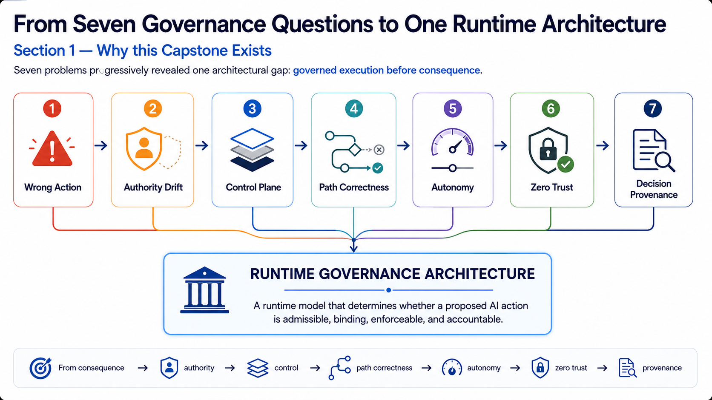
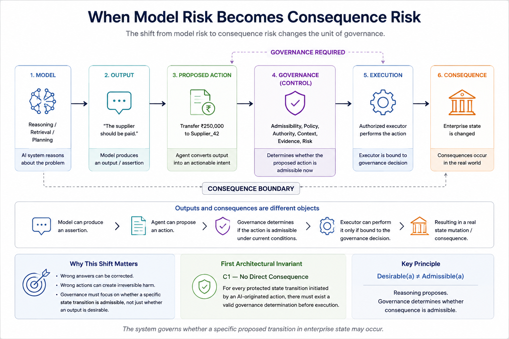
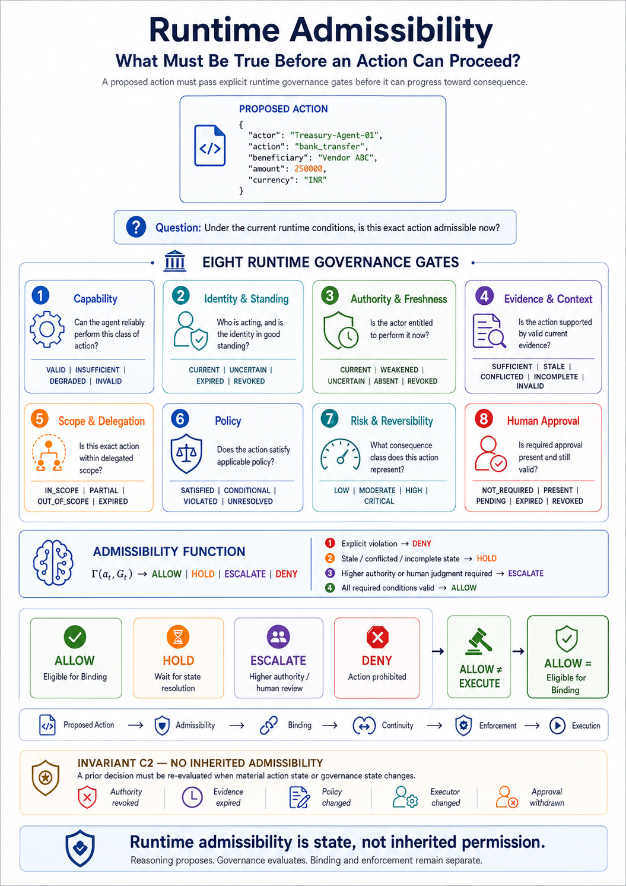
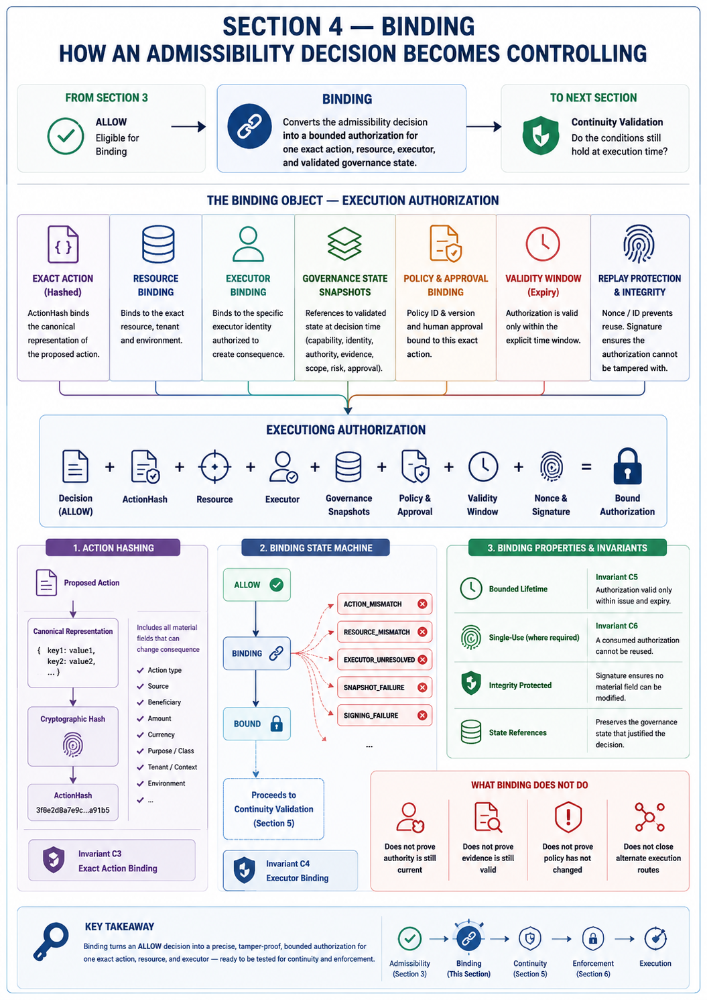
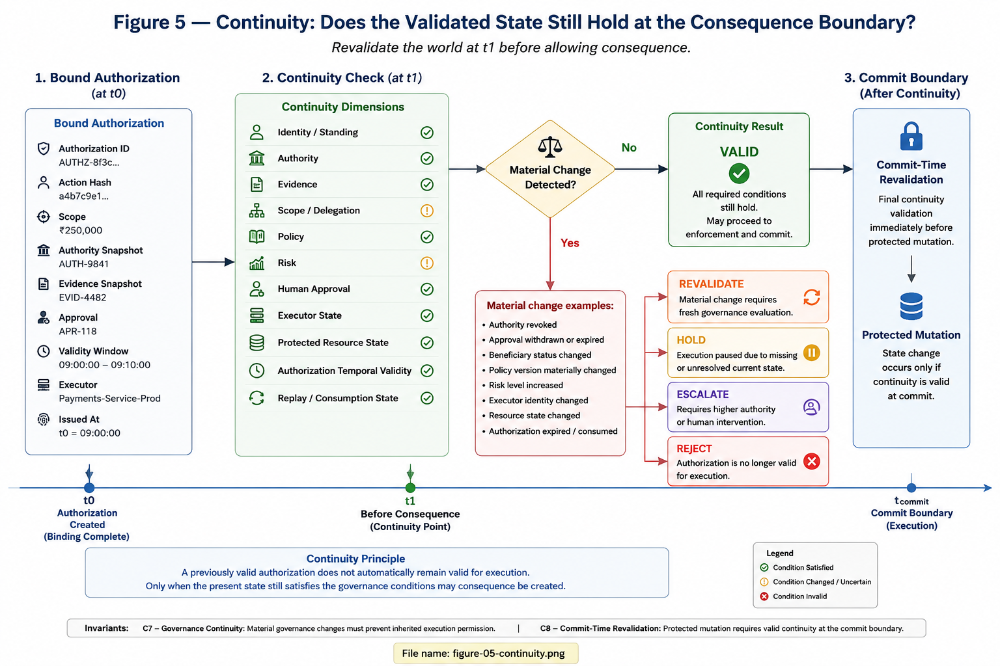
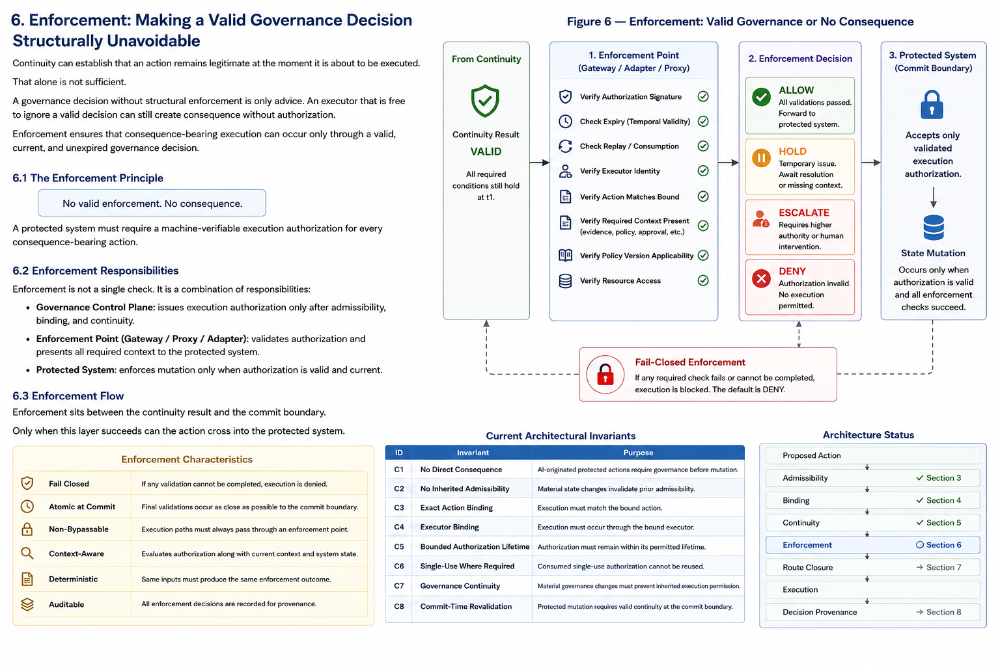
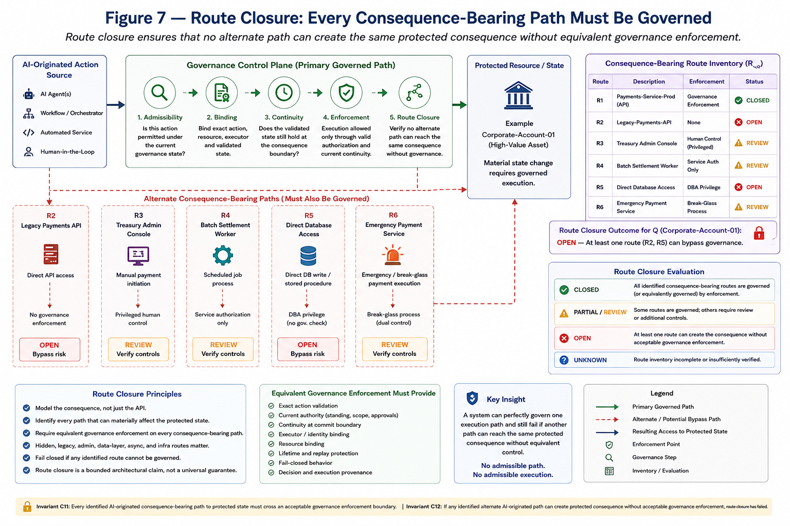
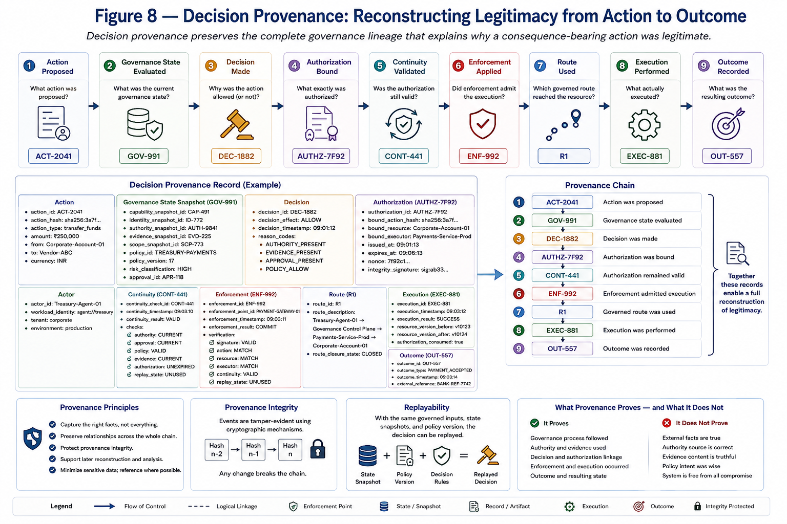

# The Agentic AI Governance Control Plane

## A Reference Architecture for Runtime Admissibility, Binding, Continuity, Enforcement, Route Closure, and Decision Provenance

**Version:** v0.1-draft  
**Status:** Reference Architecture — Work in Progress

---

## Abstract

Enterprise AI governance becomes materially different when an AI system can do more than generate text.

Once an AI agent can invoke tools, mutate enterprise systems, initiate financial transactions, modify records, change permissions, trigger workflows, or create other durable consequences, the principal governance question is no longer only whether the model produced a correct or safe output.

The governing question becomes:

> **Can this action, by this actor, under these conditions, become real now?**

This reference architecture treats that question as a runtime systems problem.

It separates the lifecycle of a consequence-bearing AI action into distinct architectural stages:

1. **Intelligence** — reasoning, retrieval, planning, memory, and action proposal.
2. **Admissibility** — determining whether the proposed action is permitted under the current governance state.
3. **Binding** — converting an admissibility decision into a bounded authorization for one exact action, resource, executor, and validated state.
4. **Continuity** — determining whether the conditions that justified the authorization still hold at the consequence boundary.
5. **Enforcement** — ensuring that consequence-bearing execution can occur only through a valid governance decision.
6. **Route Closure** — establishing that alternate paths cannot bypass equivalent governance enforcement.
7. **Execution** — creating the intended enterprise consequence.
8. **Provenance** — preserving enough evidence to reconstruct why the action was permitted, how it was executed, and what outcome followed.

The architecture is deliberately vendor-neutral. It is intended to be expressed through explicit data contracts, state transitions, invariants, enforcement mechanisms, and executable tests.

It does **not** claim to be a universal compliance framework, a legal certification model, or proof that every AI system can be made safe. Its purpose is narrower:

> **to define the control conditions under which an AI-originated action may become an enterprise consequence.**

---

# 1. Why This Capstone Exists

This architecture began as a sequence of seven questions about enterprise agentic AI governance.

Each question initially appeared separable:

- What happens when an AI produces the wrong action?
- What if the action is valid but the actor's authority has changed?
- Where should enterprise control sit between AI reasoning and execution?
- Can a multi-agent system reach the correct result while following an invalid path?
- How much autonomy should a system have for a particular consequence?
- What does Zero Trust mean when the subject is an AI agent rather than a human user?
- What evidence is required to reconstruct why a consequence occurred?

Taken independently, these appear to be questions about reliability, authorization, security, autonomy, and auditability.

They converge on a deeper architectural problem:

> **A governance decision has limited value unless it remains authoritative all the way to consequence.**

A system may correctly identify that an action is not permitted and still fail governance if some other route can execute it.

A system may correctly determine that an action is allowed and still fail governance if the action changes after approval.

A system may have valid authority when planning begins and stale authority when execution occurs.

A system may preserve excellent logs while still being unable to establish whether the action was legitimate when it happened.

The core problem is therefore not merely decision quality.

It is **governed consequence creation**.

## 1.1 From Seven Governance Questions to One Runtime Architecture

The seven ideas can be viewed as a progression:

```text
Wrong Action
    ↓
Authority Drift
    ↓
Control Plane
    ↓
Path Correctness
    ↓
Autonomy
    ↓
Zero Trust
    ↓
Decision Provenance
    ↓
RUNTIME GOVERNANCE ARCHITECTURE
```

They converge on one operating question:

> **Can this action, by this actor, under these conditions, become real now?**

<!-- IMAGE PLACEHOLDER: FIGURE 1 -->



**Figure 1 — From Seven Governance Questions to One Runtime Architecture.**

## 1.2 The Architectural Shift

A conventional AI application is often represented as:

```text
Input
  ↓
Model
  ↓
Output
```

An agentic enterprise system is materially different:

```text
Input
  ↓
Reasoning / Retrieval / Planning / Memory
  ↓
Proposed Action
  ↓
Tool / API / Workflow
  ↓
Enterprise System
  ↓
State Change
  ↓
Consequence
```

Once an AI system can alter external state, reasoning quality is only one part of the problem.

Enterprise governance must determine:

- whether the system is capable of performing the action safely;
- whether the actor still has valid standing;
- whether current authority exists;
- whether the evidence remains valid;
- whether the action is within scope;
- whether policy permits it;
- whether the consequence is proportionate to the permitted autonomy;
- whether human approval is required;
- whether the exact approved action is the action that will execute;
- whether the validated state remains current at commit time;
- whether the executor is forced to honor the governance result;
- whether another route can bypass that control;
- and whether the full decision-to-outcome chain can later be reconstructed.

This leads to the reference architecture developed in this document.

## 1.3 The Control Chain

The high-level control chain is:

```text
Proposed Action
      ↓
Admissibility
      ↓
Binding
      ↓
Continuity
      ↓
Enforcement
      ↓
Route Closure
      ↓
Execution
      ↓
Provenance
```

Each stage answers a different question.

| Stage           | Governing Question                                                                        |
| --------------- | ----------------------------------------------------------------------------------------- |
| Proposed Action | What does the AI system intend to do?                                                     |
| Admissibility   | Should this action be permitted under the current governance state?                       |
| Binding         | Exactly which action, resource, executor, and validated state does the decision apply to? |
| Continuity      | Do the conditions that justified the decision still hold now?                             |
| Enforcement     | Is execution structurally forced to honor the governance result?                          |
| Route Closure   | Can any alternate consequence-bearing path bypass equivalent control?                     |
| Execution       | What mutation or external consequence actually occurred?                                  |
| Provenance      | Can the legitimacy and outcome of the action be reconstructed?                            |

## 1.4 Architectural Planes

### Intelligence Plane

Responsible for reasoning, retrieval, planning, memory, tool selection, multi-agent coordination, and candidate action generation.

The intelligence plane may recommend or propose. It does not independently create execution authority.

### Governance Decision Plane

Responsible for evaluating capability, identity and standing, authority, evidence, scope, policy, risk and reversibility, and human approval.

Its output is:

```text
ALLOW
HOLD
ESCALATE
DENY
```

### Binding / Control Plane

Responsible for converting an admissibility decision into a bounded authorization tied to the exact action, resource, executor, governance-state references, validity period, replay protection, and integrity proof.

### Enforcement / Execution Plane

Responsible for continuity validation, commit-boundary checks, authorization verification, controlled mutation, and execution receipt generation.

### Accountability Plane

Responsible for preserving decision provenance, authority state, evidence state, policy version, approval state, binding state, continuity outcome, execution receipt, resulting state, and replayability.

## 1.5 Design Principle

> **Governance is not merely the decision to allow or deny. Governance is making that decision binding on consequence.**

Every architectural claim in this document should eventually be one of the following:

1. demonstrable in code;
2. testable through an invariant;
3. enforceable through a system boundary; or
4. explicitly identified as a design principle rather than a proven guarantee.

This capstone is therefore not a summary of seven articles. It consolidates the series into an implementable reference architecture whose claims can later be expressed as system invariants, enforcement mechanisms, and executable tests.

---

# 2. From Model Risk to Consequence Risk

Traditional AI safety and evaluation often begin with the model output. That remains important, but it is insufficient for systems capable of external action.

Suppose a model produces:

```text
"Transfer ₹250,000 to Vendor ABC."
```

At the model layer, possible questions include:

- Is the statement factually correct?
- Was the beneficiary identified correctly?
- Did the model hallucinate?
- Is the recommendation consistent with retrieved evidence?
- Was the reasoning valid?

Those are model and decision-quality questions. They are not yet consequence-governance questions.

The risk changes when the recommendation becomes:

```text
transfer_funds(
    source="Corporate-Account-01",
    beneficiary="Vendor-ABC",
    amount=250000
)
```

At that point the system is no longer merely producing information. It is proposing a state transition.

## 2.1 Output Validity and State Transition Validity Are Different Problems

A simplified model interaction can be written as:

```text
y = M(x)
```

An agentic system introduces an action policy:

```text
a = π(y, c)
```

Execution then changes enterprise state:

```text
S_(t+1) = E(S_t, a)
```

The governance question therefore changes from:

```text
Valid(y)?
```

to:

```text
Permitted(S_t → S_(t+1))?
```

## 2.2 Consequence Governance

For a proposed action `a_t`, current state `S_t`, and governance state `G_t`, define:

```text
Γ(a_t, S_t, G_t) ∈ {ALLOW, HOLD, ESCALATE, DENY}
```

The important separations are:

```text
Desirable(a_t) ≠> Admissible(a_t)
```

and:

```text
Admissible(a_t) ≠> Executable(a_t)
```

A system may conclude that an action is desirable while governance determines that it is not currently admissible.

Likewise, a governance system may determine that an action is admissible while execution must still wait for binding, continuity validation, and enforcement.

## 2.3 Consequence Classes

Relevant consequence dimensions may include:

- financial impact;
- reversibility;
- confidentiality;
- integrity;
- availability;
- legal or regulatory effect;
- privilege;
- persistence;
- propagation;
- recoverability.

| Action                      | Consequence Characteristics                      |
| --------------------------- | ------------------------------------------------ |
| Draft an internal email     | low persistence, reversible                      |
| Read a customer record      | confidentiality-sensitive                        |
| Update CRM notes            | state mutation, usually reversible               |
| Approve a refund            | financial consequence                            |
| Create a privileged account | high privilege, security-sensitive               |
| Transfer funds              | financial, potentially irreversible              |
| Delete production data      | integrity/availability, potentially irreversible |

## 2.4 The Consequence Boundary

The **consequence boundary** is the point at which a proposed action can create externally meaningful state change.

```text
Reasoning
   ↓
Proposed Action
   ↓
Governance
   ↓
Binding
   ↓
Enforcement
-------------------- CONSEQUENCE BOUNDARY
   ↓
Execution
   ↓
Enterprise State Mutation
```

Before the boundary, the system may reason, evaluate, simulate, classify, retrieve, and prepare.

After the boundary, the system can make something real.

<!-- IMAGE PLACEHOLDER: FIGURE 2 -->



**Figure 2 — When Model Risk Becomes Consequence Risk.**

## 2.5 Invariant C1 — No Direct Consequence

```text
Protected(a_t) AND AIOrigin(a_t) => Governed(a_t)
```

> **An AI-originated protected action must not mutate protected state without a governance determination.**

This invariant does **not yet prove** that every alternate path to protected state is governed. That stronger requirement belongs to route closure.

## 2.6 Why Logging Is Not Enough

Post-event logs can answer:

> What happened?

They may not answer:

> Was the action entitled to happen under the state that existed at the time of execution?

A governance record should be capable of establishing:

- which action was proposed;
- which actor proposed it;
- what authority existed;
- what evidence applied;
- which policy version governed it;
- what risk state existed;
- whether approval was required;
- who approved;
- whether those conditions remained current;
- which executor performed the action;
- whether the action matched the authorized action;
- and what resulting state followed.

## 2.7 Section 2 Conclusion

> **Reasoning must never be equivalent to execution authority.**

The next question is:

> **What must be true before a proposed action becomes admissible?**

---

# 3. Runtime Admissibility: What Must Be True Before an Action Can Proceed?

Runtime admissibility determines whether a proposed action is permitted under the governance state that exists **now**.

It is not inherited from previous approval, previous identity verification, a valid login, a system role, earlier authority, a previous successful action, or the fact that the AI system is generally trusted.

## 3.1 Governance State

```text
G_t = {
    C_t,
    I_t,
    U_t,
    E_t,
    S_t,
    P_t,
    R_t,
    H_t
}
```

| Symbol | Governance Dimension   |
| ------ | ---------------------- |
| `C_t`  | Capability             |
| `I_t`  | Identity and Standing  |
| `U_t`  | Authority              |
| `E_t`  | Evidence and Context   |
| `S_t`  | Scope and Delegation   |
| `P_t`  | Policy                 |
| `R_t`  | Risk and Reversibility |
| `H_t`  | Human Approval         |

```text
Γ(a_t, G_t) ∈ {ALLOW, HOLD, ESCALATE, DENY}
```

Crucially:

```text
ALLOW ≠ EXECUTE
```

An `ALLOW` decision means only that the action has satisfied the current admissibility conditions and may proceed to **Binding**.

## 3.2 Gate 1 — Capability

```text
C_t(a) ∈ {
    VALID,
    INSUFFICIENT,
    DEGRADED,
    INVALID
}
```

Capability may depend on validated task performance, tool-use reliability, error rates, evaluation results, environment, action class, consequence class, and recent operational observations.

```text
Capability ≠ Authority
```

## 3.3 Gate 2 — Identity and Standing

Identity asks:

> **Which actor is making the request?**

Standing asks:

> **Is that actor currently recognized as eligible to exercise governance-relevant authority?**

```text
I_t(a) ∈ {
    CURRENT,
    UNCERTAIN,
    EXPIRED,
    REVOKED
}
```

Identity and standing must not be collapsed into authentication.

## 3.4 Gate 3 — Authority and Freshness

```text
U_t(a) ∈ {
    CURRENT,
    WEAKENED,
    UNCERTAIN,
    ABSENT,
    REVOKED
}
```

Conceptually:

```text
AuthorityValid =
    f(
        grant,
        scope,
        time,
        state_change,
        consequence
    )
```

A prior authority record establishes historical entitlement. It does not automatically establish present entitlement.

## 3.5 Gate 4 — Evidence and Context

```text
E_t(a) ∈ {
    SUFFICIENT,
    STALE,
    CONFLICTED,
    INCOMPLETE,
    INVALID
}
```

```text
CorrectReasoning ≠ ValidEvidence
```

A model can reason correctly from stale evidence. Governance must therefore treat evidence state as an independent input.

## 3.6 Gate 5 — Scope and Delegation

```text
S_t(a) ∈ {
    IN_SCOPE,
    PARTIAL,
    OUT_OF_SCOPE,
    EXPIRED
}
```

Example:

```text
Delegation:
    Treasury-Agent-01
    may initiate vendor payments
    up to ₹100,000
```

Proposed action:

```text
₹250,000 transfer
```

Therefore:

```text
Authorized(action_type) ≠ Authorized(exact_action)
```

## 3.7 Gate 6 — Policy

```text
P_t(a) ∈ {
    SATISFIED,
    CONDITIONAL,
    VIOLATED,
    UNRESOLVED
}
```

The policy identity and version should be preserved:

```text
policy_id      = TREASURY-PAYMENTS
policy_version = 17
```

## 3.8 Gate 7 — Risk and Reversibility

```text
R_t(a) =
    f(
        Impact,
        Reversibility,
        Persistence,
        Privilege,
        Propagation,
        Recoverability
    )
```

Possible classifications:

```text
LOW
MODERATE
HIGH
CRITICAL
```

> **Greater consequence should generally reduce unreviewed autonomy.**

## 3.9 Gate 8 — Human Approval

```text
H_t(a) ∈ {
    NOT_REQUIRED,
    PRESENT,
    PENDING,
    EXPIRED,
    REVOKED
}
```

Approval should be bound to the exact action, material parameters, approving authority, scope, timestamp, expiration, and relevant state assumptions.

```text
Approved(a) ≠ Approved(a')
```

if `a'` materially differs from `a`.

## 3.10 The Admissibility Function

```text
A_t = Admissible(a_t, G_t)
```

A simplified Boolean concept is:

```text
C AND I AND U AND E AND S AND P AND R AND H
```

but the deterministic governance transition should be explicit:

```text
Γ(a_t, G_t) ∈ {
    ALLOW,
    HOLD,
    ESCALATE,
    DENY
}
```

A practical rule hierarchy:

```text
1. Explicit mandatory violation
       → DENY

2. Required state unresolved, stale, conflicted, or incomplete
       → HOLD

3. Higher authority or human judgment required
       → ESCALATE

4. All required governance conditions valid
       → ALLOW
```

LLMs may assist interpretation, extraction, classification, evidence synthesis, or candidate policy mapping. The final governance state transition should come from explicit rules over governed state.

## 3.11 The Four Outcomes

### ALLOW

```text
ALLOW = ELIGIBLE_FOR_BINDING
```

### HOLD

Execution cannot proceed because a required condition is unresolved or temporarily invalid.

### ESCALATE

The system requires a higher authority or explicit human judgment.

### DENY

The action violates a mandatory governance condition.

## 3.12 Uncertainty Must Change State

> **Absence of evidence must not silently become evidence of validity.**

For example:

```text
Evidence unavailable
        ↓
HOLD
```

Similarly:

```text
Authority uncertain
        ↓
HOLD / ESCALATE
```

## 3.13 Runtime Admissibility State Machine

```text
PROPOSED
   ↓
EVALUATING
   ├──→ ALLOW
   ├──→ HOLD
   ├──→ ESCALATE
   └──→ DENY
```

A `HOLD` or `ESCALATE` may return to evaluation after the required state changes.

A `DENY` cannot enter Binding under the same material action state.

## 3.14 Invariant C2 — No Inherited Admissibility

```text
MaterialChange(a_t, G_t)
    =>
Invalidate(Γ_previous)
```

> **A previous admissibility decision must not automatically remain valid after a material change in the action or governance state.**

Therefore:

```text
ALLOW_t0 ≠ automatically ALLOW_t1
```

## 3.15 Runtime Admissibility Architecture

<!-- IMAGE PLACEHOLDER: FIGURE 3 -->



**Figure 3 — Runtime Admissibility: What Must Be True Before an Action Can Proceed?**

## 3.16 Section 3 Conclusion

Runtime admissibility asks:

> **Should this action be permitted under the current governance state?**

If the result is `ALLOW`, the action becomes:

```text
ALLOW
  ↓
ELIGIBLE_FOR_BINDING
```

The next proof obligation is:

> **Can this decision be made specific to one exact action, resource, executor, and validated state?**

---

# 4. Binding: How an Admissibility Decision Becomes Controlling

Section 3 established:

```text
ALLOW ≠ EXECUTE
```

and:

```text
ALLOW = ELIGIBLE_FOR_BINDING
```

Binding converts an admissibility determination into a bounded authorization for one specific action, resource, executor, and validated governance state.

## 4.1 The Binding Problem

This is insufficient:

```text
decision = ALLOW
actor    = Treasury-Agent-01
action   = transfer_funds
```

It does not specify source account, beneficiary, amount, resource, tenant, environment, executor, authority state, evidence state, policy version, approval, authorization lifetime, replay behavior, or integrity proof.

A stronger statement is:

> **Payments-Service-Prod may execute this exact ₹250,000 transfer from Corporate-Account-01 to Vendor-ABC, based on the validated governance state identified in this authorization, before its expiry, and subject to continuity validation.**

## 4.2 Binding Function

```text
D_t0 = Γ(a_t0, G_t0)
```

where:

```text
D_t0 = ALLOW
```

Then:

```text
B_t0 = Bind(
    D_t0,
    a_t0,
    G_t0,
    X
)
```

The output is a bounded execution authorization candidate.

```text
Admissibility Decision
        +
Exact Action
        +
Resource
        +
Executor
        +
Governance State References
        +
Validity Window
        +
Replay Protection
        +
Integrity Proof
        ↓
Bound Execution Authorization
```

## 4.3 Action Binding

```text
Canonical(a)
```

Then:

```text
ActionHash = H(Canonical(a))
```

At execution:

```text
H(Canonical(a_execution))
    =
ActionHash_bound
```

If:

```text
H(a_execution) ≠ H(a_bound)
```

the authorization no longer applies.

## 4.4 Canonicalization Is Part of the Security Boundary

Canonicalization should define at minimum:

- deterministic field ordering;
- numeric normalization;
- currency representation;
- Unicode normalization;
- date/time representation;
- explicit optional-field semantics;
- explicit null semantics;
- distinction between material and non-material metadata.

## 4.5 Resource Binding

```text
ResourceBinding = {
    resource_type,
    resource_id,
    tenant,
    environment
}
```

Example:

```text
resource_type = bank_account
resource_id   = Corporate-Account-01
tenant        = Enterprise-A
environment   = production
```

At execution:

```text
AuthorizedResource(a)
    =
BoundResource
```

Otherwise:

```text
RESOURCE_MISMATCH
    → REJECT
```

## 4.6 Executor Binding

Requesting actor and authorized executor are distinct:

```text
Requesting Actor:
    Treasury-Agent-01

Authorized Executor:
    Payments-Service-Prod
```

At execution:

```text
Executor_execution
    =
X_bound
```

Otherwise:

```text
EXECUTOR_MISMATCH
    → REJECT
```

Executor binding does **not** prove that no alternate path exists. That is the route-closure problem.

## 4.7 Governance-State Binding

Bind stable references or immutable snapshots such as:

```text
capability_snapshot_id
identity_snapshot_id
authority_snapshot_id
evidence_snapshot_id
scope_snapshot_id
policy_version
risk_classification_id
approval_id
```

These references support both continuity validation and later provenance.

## 4.8 Authority-State Binding

```text
BoundAuthoritySnapshot
    ≠
CurrentAuthorityProof
```

The bound snapshot proves what authority state was relied upon when the authorization was created. It does not prove that authority still holds later.

## 4.9 Evidence-State Binding

```text
EvidenceHash =
    H(
        Canonical(EvidenceManifest)
    )
```

But:

```text
EvidenceWasValid_t0
    ≠>
EvidenceIsValid_t1
```

## 4.10 Policy Binding

```text
PolicyBinding = {
    policy_id: "TREASURY-PAYMENTS",
    policy_version: 17
}
```

The policy basis must remain explicit enough for continuity and provenance.

## 4.11 Human Approval Binding

Do not reduce approval to:

```text
approved = true
```

Instead preserve:

```text
approval_id
approver_identity
approved_action_hash
approval_scope
approval_timestamp
approval_expiry
```

And require:

```text
ApprovedActionHash
    =
BoundActionHash
```

## 4.12 Binding Time and Expiration

```text
t_issue
t_expiry
```

Valid only when:

```text
t_issue <= t_current < t_expiry
```

Otherwise:

```text
EXPIRED
    → REJECT
```

A conceptual TTL:

```text
TTL =
    f(
        consequence,
        authority_volatility,
        evidence_volatility,
        risk,
        policy
    )
```

## 4.13 Replay Protection

Use a unique authorization identifier or nonce.

Where single-use semantics apply:

```text
Consume(AuthZ_id)
```

must be atomic.

```text
First Use
    → VALID

Second Use
    → REPLAY_REJECTED
```

## 4.14 Integrity Protection

Conceptually:

```text
Signature =
    Sign(
        K_private,
        H(
            Canonical(ExecutionAuthorization)
        )
    )
```

Equivalent mechanisms may include asymmetric signatures, signed tokens, keyed MACs, hardware-backed signatures, or workload-attested authorization objects.

> **Material authorization fields must not be modifiable without invalidating the authorization.**

## 4.15 Conceptual Execution Authorization

```json
{
  "authorization_id": "AUTHZ-7F92",
  "decision_id": "DEC-1882",
  "actor_id": "Treasury-Agent-01",
  "executor_id": "Payments-Service-Prod",
  "action_type": "transfer_funds",
  "action_hash": "sha256:...",
  "resource": {
    "type": "bank_account",
    "id": "Corporate-Account-01",
    "tenant": "Enterprise-A",
    "environment": "production"
  },
  "governance_state": {
    "capability_snapshot_id": "CAP-491",
    "identity_snapshot_id": "ID-772",
    "authority_snapshot_id": "AUTH-9841",
    "evidence_snapshot_id": "EVD-225",
    "scope_snapshot_id": "SCP-773",
    "policy": {
      "id": "TREASURY-PAYMENTS",
      "version": 17
    },
    "risk_classification": "HIGH",
    "approval_id": "APR-118"
  },
  "issued_at": "2026-08-19T09:00:00Z",
  "expires_at": "2026-08-19T09:05:00Z",
  "nonce": "9ecf...",
  "signature": "..."
}
```

This schema is illustrative rather than normative.

## 4.16 Binding Does Not Create Permanent Permission

Between binding and execution, governance-relevant conditions may change.

Therefore:

```text
Bound_t0
    ≠>
NecessarilyExecutable_t1
```

Binding proves what was authorized. It does not prove that the authorization remains executable later.

## 4.17 Binding State Machine

```text
ALLOW
  ↓
BINDING
  ├──→ ACTION_MISMATCH
  ├──→ RESOURCE_MISMATCH
  ├──→ EXECUTOR_UNRESOLVED
  ├──→ SNAPSHOT_FAILURE
  ├──→ SIGNING_FAILURE
  └──→ BOUND
```

Only `BOUND` may proceed to continuity.

## 4.18 Binding Invariants

### Invariant C3 — Exact Action Binding

```text
ExecutionActionHash
    =
BoundActionHash
```

Otherwise:

```text
REJECT
```

### Invariant C4 — Executor Binding

```text
Executor_current
    =
Executor_bound
```

Otherwise:

```text
REJECT
```

### Invariant C5 — Bounded Authorization Lifetime

```text
t_issue <= t_current < t_expiry
```

Otherwise:

```text
REJECT_EXPIRED
```

### Invariant C6 — Single-Use Where Required

```text
Consumed(AuthZ_id)
    =>
NOT Reusable(AuthZ_id)
```

Enforcement must be atomic.

## 4.19 What Binding Proves — and What It Does Not

Binding can establish that a governance decision applies to:

- a specific decision;
- a specific actor;
- a specific action;
- a specific protected resource;
- a specific executor;
- specific governance-state references;
- a specific policy version;
- a specific approval;
- a bounded validity period;
- a unique authorization object;
- an integrity-protected representation.

Binding does **not** by itself prove:

- that authority is still current;
- that evidence is still valid;
- that approval has not been revoked;
- that policy remains applicable;
- that the resource state has not materially changed;
- that the executor remains trustworthy;
- that an alternate execution path does not exist.

## 4.20 Binding Architecture

<!-- IMAGE PLACEHOLDER: FIGURE 4 -->



**Figure 4 — Binding: From ALLOW to Bounded Execution Authorization.**

## 4.21 Section 4 Conclusion

Admissibility asks:

> **Should this action be permitted under the current governance state?**

Binding asks:

> **Exactly which action, resource, executor, and validated state does that decision apply to?**

The system must still answer:

> **Do the conditions that justified this authorization still hold when the system is ready to create consequence?**


---

# 5. Continuity: Does the Validated State Still Hold at the Consequence Boundary?

Binding establishes exactly what was authorized.

It does **not** establish that the conditions supporting that authorization will remain valid until execution.

Between the creation of a bounded authorization at time `t0` and an execution attempt at time `t1`, the enterprise state may change.

Authority may be revoked.

Evidence may become stale.

A policy may change.

A human approval may expire.

The protected resource may change state.

The authorized executor may no longer be the same trusted principal.

An incident may increase the risk associated with the action.

The execution authorization itself may expire or already have been consumed.

The architecture must therefore distinguish:

```text
Valid at binding time
        ≠
Valid at execution time
```

Continuity is the mechanism that closes this temporal gap.

It asks:

> **Do the governance conditions that justified this authorization still hold when the system is ready to create consequence?**

---

## 5.1 The Time-of-Check / Time-of-Use Problem

Suppose a transfer is evaluated at:

```text
t0 = 09:00:00
```

At that moment:

```text
Authority      = CURRENT
Evidence       = SUFFICIENT
Policy         = SATISFIED
Approval       = PRESENT
Risk           = HIGH
Executor       = Payments-Service-Prod
```

The action receives:

```text
ALLOW
```

and is successfully bound.

Execution does not occur immediately.

At:

```text
t1 = 09:02:30
```

one of the following happens:

```text
Authority revoked
```

or:

```text
Approval withdrawn
```

or:

```text
Beneficiary status changed
```

or:

```text
Policy version updated
```

or:

```text
Executor identity changed
```

If the system executes solely because the authorization was valid at `t0`, it has converted historical validity into present permission.

That is unsafe.

The correct question at the consequence boundary is:

```text
Is the authorization still valid now?
```

---

## 5.2 Bound State and Current State

Let the governance state relied upon during binding be:

```text
G_t0
```

The current governance state at execution time is:

```text
G_t1
```

Continuity therefore evaluates the relationship between:

```text
G_t0
```

and:

```text
G_t1
```

A simple equality test is insufficient.

Some fields may be allowed to change.

Other fields may require re-evaluation.

Some changes may invalidate the authorization immediately.

Continuity is therefore better represented as:

```text
K_t1 =
    Continuity(
        Authorization,
        G_t0,
        G_t1,
        ExecutionContext_t1
    )
```

where:

```text
K_t1 ∈ {
    VALID,
    REVALIDATE,
    HOLD,
    ESCALATE,
    REJECT
}
```

---

## 5.3 Continuity Is Not Repeating the Entire Workflow Blindly

Continuity does not necessarily require rerunning every governance operation from the beginning for every execution attempt.

Instead, it determines which governance dimensions must still be proven current.

For example:

```text
Bound Authorization
        ↓
Continuity Check
        ├── Authority current?
        ├── Identity / standing current?
        ├── Evidence still valid?
        ├── Scope unchanged?
        ├── Policy still applicable?
        ├── Risk materially changed?
        ├── Approval still valid?
        ├── Resource state compatible?
        ├── Executor still valid?
        ├── Authorization unexpired?
        └── Authorization unconsumed?
```

The required checks should depend on the consequence class and enterprise policy.

---

## 5.4 The Continuity Vector

The continuity state can be modeled as a vector:

```text
K_t = {
    I_t,
    U_t,
    E_t,
    S_t,
    P_t,
    R_t,
    H_t,
    X_t,
    Q_t,
    T_t,
    N_t
}
```

where:

| Symbol | Continuity Dimension            |
| ------ | ------------------------------- |
| `I_t`  | Identity / standing             |
| `U_t`  | Authority                       |
| `E_t`  | Evidence                        |
| `S_t`  | Scope / delegation              |
| `P_t`  | Policy                          |
| `R_t`  | Risk                            |
| `H_t`  | Human approval                  |
| `X_t`  | Executor state                  |
| `Q_t`  | Protected resource state        |
| `T_t`  | Authorization temporal validity |
| `N_t`  | Replay / consumption state      |

The exact dimensions may vary by implementation.

The architectural requirement is that material state capable of changing execution legitimacy must not be silently ignored.

---

## 5.5 Identity and Standing Continuity

The system must establish that the relevant principal still has valid standing.

At binding:

```text
IdentitySnapshot = ID-772
Standing         = CURRENT
```

At execution:

```text
Standing_current
```

must still satisfy the required condition.

A change such as:

```text
CURRENT → REVOKED
```

must invalidate continuation.

Similarly:

```text
CURRENT → UNCERTAIN
```

should not silently inherit the prior result.

A possible outcome is:

```text
UNCERTAIN
    → HOLD
```

or:

```text
UNCERTAIN
    → ESCALATE
```

depending on policy.

---

## 5.6 Authority Continuity

Authority is one of the most important continuity dimensions.

At binding:

```text
authority_snapshot_id = AUTH-9841
```

The authorization proves that this authority state supported the decision at `t0`.

At execution, the system must determine whether the relevant authority remains current.

Conceptually:

```text
AuthorityContinuity =
    CheckCurrentAuthority(
        actor,
        action,
        resource,
        bound_authority_snapshot
    )
```

Possible outcomes:

```text
CURRENT
WEAKENED
UNCERTAIN
ABSENT
REVOKED
```

For a consequence-bearing action:

```text
REVOKED
    → REJECT
```

while:

```text
UNCERTAIN
    → HOLD / ESCALATE
```

may be appropriate.

The exact outcome is policy-specific.

The architectural requirement is not.

> **A previously valid authority state must not automatically survive a material authority change.**

---

## 5.7 Evidence Continuity

Evidence used at admissibility may no longer be valid at execution.

For example:

```text
Invoice status at t0:
    APPROVED

Invoice status at t1:
    CANCELLED
```

or:

```text
Beneficiary status at t0:
    VERIFIED

Beneficiary status at t1:
    UNDER_REVIEW
```

The original evidence remains historically relevant.

But it may no longer support execution.

Therefore:

```text
EvidenceContinuity =
    Evaluate(
        BoundEvidence,
        CurrentEvidenceState
    )
```

Possible states may include:

```text
CURRENT
STALE
SUPERSEDED
CONFLICTED
INVALID
```

A materially changed evidence state should invalidate inherited execution permission.

---

## 5.8 Scope and Delegation Continuity

Delegation can change after binding.

Suppose:

```text
t0:
Treasury-Agent-01 may initiate payments up to ₹500,000
```

The transfer is bound.

Before execution:

```text
t1:
Limit reduced to ₹100,000
```

The proposed transfer remains:

```text
₹250,000
```

The original binding is historically valid.

The current delegation is not.

Continuity must therefore re-establish:

```text
CurrentScope(a_execution)
    includes
BoundAction(a)
```

Otherwise:

```text
OUT_OF_SCOPE
    → REJECT
```

or, where policy allows reconsideration:

```text
→ ESCALATE
```

---

## 5.9 Policy Continuity

Binding records the policy basis used during admissibility.

For example:

```text
policy_id      = TREASURY-PAYMENTS
policy_version = 17
```

At execution time the active policy may be:

```text
policy_version = 18
```

A policy-version change does not automatically mean the authorization is invalid.

But it must trigger an explicit policy decision.

Possible strategies include:

```text
Grandfather bound authorization
```

or:

```text
Require re-evaluation under current policy
```

or:

```text
Invalidate authorization immediately
```

The appropriate strategy is enterprise-specific.

The architecture requires that the transition be explicit.

It must not become:

```text
Policy changed
    ↓
ignore change
    ↓
execute anyway
```

---

## 5.10 Human Approval Continuity

Approval is also stateful.

At binding:

```text
approval_id = APR-118
status      = PRESENT
```

At execution:

```text
approval_status
```

may have changed to:

```text
REVOKED
EXPIRED
SUPERSEDED
```

Continuity must verify that:

```text
Approval_current
```

still applies to:

```text
BoundActionHash
```

and remains within its permitted lifetime and scope.

A revoked approval must not continue to authorize execution merely because the authorization object still contains the historical approval reference.

---

## 5.11 Risk Continuity

Risk can change after binding even if the action itself does not.

Examples include:

- fraud alert raised;
- cybersecurity incident declared;
- beneficiary risk classification increased;
- market volatility threshold crossed;
- system health degraded;
- transaction velocity increased;
- related account placed under investigation.

Therefore:

```text
Risk_t0
    ≠>
Risk_t1
```

If a material risk change occurs, continuity may require:

```text
REVALIDATE
```

or:

```text
ESCALATE
```

or:

```text
REJECT
```

depending on policy.

---

## 5.12 Executor Continuity

Section 4 bound the authorization to an executor.

For example:

```text
executor_id = Payments-Service-Prod
```

Continuity must verify not only that the identifier matches, but that the current executor remains acceptable.

Depending on implementation, this may include:

- workload identity;
- certificate validity;
- service principal status;
- runtime attestation;
- environment;
- deployment version;
- security posture;
- tenant context.

Conceptually:

```text
Executor_current
    =
Executor_bound
```

is necessary.

But for high-consequence systems it may not be sufficient.

The executor may also need to satisfy current trust conditions.

---

## 5.13 Protected Resource Continuity

The target resource can change between authorization and execution.

For example:

```text
Bound Resource:
Corporate-Account-01
```

may later become:

```text
Frozen
```

or:

```text
Closed
```

or:

```text
Restricted
```

or:

```text
Ownership changed
```

Therefore continuity should evaluate whether the current resource state remains compatible with the authorized action.

Conceptually:

```text
ResourceCompatible(
    BoundAction,
    ResourceState_current
)
```

must hold.

---

## 5.14 Temporal Continuity

Section 4 defined:

```text
t_issue <= t_current < t_expiry
```

Continuity must enforce this condition at the moment the authorization is presented for execution.

If:

```text
t_current >= t_expiry
```

then:

```text
REJECT_EXPIRED
```

There should be no automatic grace period unless explicitly defined by policy.

An expired authorization may be re-evaluated and rebound.

It should not simply be revived.

---

## 5.15 Replay-State Continuity

The authorization must also remain unused where single-use semantics apply.

At execution:

```text
Consumed(AuthZ_id)?
```

must be checked.

If:

```text
TRUE
```

then:

```text
REPLAY_REJECTED
```

This must be coordinated with the actual commit operation.

Otherwise two concurrent requests could both pass the continuity check before either marks the authorization consumed.

This introduces an important architectural requirement:

> **Some continuity conditions must be validated atomically with execution.**

---

## 5.16 Material Change

Not every state difference requires invalidation.

The system therefore needs an explicit definition of material change.

Conceptually:

```text
MaterialChange =
    f(
        action,
        authority,
        evidence,
        scope,
        policy,
        risk,
        approval,
        executor,
        resource,
        time,
        replay_state
    )
```

Examples of material changes may include:

```text
amount changed
beneficiary changed
authority revoked
approval expired
policy materially changed
resource frozen
risk escalated
executor identity changed
authorization expired
authorization consumed
```

Examples of non-material changes might include:

```text
display label changed
non-security metadata updated
logging correlation ID changed
presentation formatting changed
```

The materiality rules must be explicit and testable.

---

## 5.17 Continuity Outcomes

A useful continuity result model is:

```text
VALID
REVALIDATE
HOLD
ESCALATE
REJECT
```

### VALID

All required continuity conditions still hold.

The authorization may proceed toward enforcement and commit.

### REVALIDATE

A material state change requires a fresh governance evaluation.

The previous authorization must not be used directly.

### HOLD

Execution is temporarily paused because required current state is unavailable or unresolved.

### ESCALATE

Current conditions require higher authority or human intervention.

### REJECT

The authorization is no longer valid for execution.

Examples include:

- revoked authority;
- expired authorization;
- consumed authorization;
- invalid executor;
- prohibited resource state;
- revoked approval.

---

## 5.18 Continuity State Machine

A conceptual state machine is:

```text
BOUND
  ↓
CONTINUITY_CHECK
  ├──→ VALID
  ├──→ REVALIDATE
  ├──→ HOLD
  ├──→ ESCALATE
  └──→ REJECT
```

Only:

```text
VALID
```

may proceed toward the commit boundary.

A `REVALIDATE` outcome returns the action to governance evaluation.

Conceptually:

```text
BOUND
  ↓
CONTINUITY_CHECK
  ↓
REVALIDATE
  ↓
ADMISSIBILITY
  ↓
BINDING
```

A new authorization should be created if the action is subsequently allowed.

The previous authorization should not be silently updated in place.

---

## 5.19 Commit-Time Revalidation

A continuity check performed several seconds before execution may itself become stale.

For high-consequence actions, the strongest validation point is therefore immediately before protected mutation.

Conceptually:

```text
Authorization Presented
        ↓
Continuity Validation
        ↓
Commit-Time Revalidation
        ↓
Protected Mutation
```

The interval between the final check and the state mutation should be minimized.

For checks whose state can change independently, implementations may require:

- transactional validation;
- atomic compare-and-set;
- database constraints;
- version checks;
- locks;
- conditional writes;
- short-lived signed proofs;
- policy-engine decisions bound to transaction state.

The architecture does not prescribe a universal mechanism.

It requires that the final consequence not depend on a materially stale validation result.

---

## 5.20 The Commit Boundary

The **commit boundary** is the final point before irreversible or externally meaningful state mutation.

Conceptually:

```text
Reasoning
    ↓
Admissibility
    ↓
Binding
    ↓
Continuity
    ↓
-------------------------
      COMMIT BOUNDARY
-------------------------
    ↓
Execution
    ↓
Consequence
```

At this boundary, the system must establish at least:

```text
Exact action matches
Executor matches
Authorization unexpired
Authorization unconsumed
Authority current
Approval current
Required evidence valid
Applicable policy satisfied
Resource state compatible
Required risk conditions satisfied
```

Only then may the system proceed to mutation.

---

## 5.21 Continuity and the Bank Transfer Example

Consider:

```text
Action:
Transfer ₹250,000
from Corporate-Account-01
to Vendor-ABC
```

At `t0`:

```text
Capability      = VALID
Identity        = CURRENT
Authority       = CURRENT
Evidence        = SUFFICIENT
Scope           = IN_SCOPE
Policy          = SATISFIED
Risk            = HIGH
Approval        = PRESENT
```

The action receives:

```text
ALLOW
```

and a bounded authorization is created.

At `t1`, immediately before commit:

```text
Capability      = VALID
Identity        = CURRENT
Authority       = CURRENT
Evidence        = SUFFICIENT
Scope           = IN_SCOPE
Policy          = SATISFIED
Risk            = HIGH
Approval        = PRESENT
Executor        = MATCH
Resource        = ACTIVE
Authorization  = UNEXPIRED
Replay State    = UNUSED
```

Continuity result:

```text
VALID
```

The action may proceed toward enforcement.

Now change one condition:

```text
Approval = REVOKED
```

Continuity becomes:

```text
REJECT
```

The original `ALLOW` decision and valid binding do not override the current approval state.

This is exactly why continuity exists.

---

## 5.22 Invariant C7 — Governance Continuity

For any bounded authorization:

```text
MaterialGovernanceChange(
    G_t0,
    G_t1
)
    =>
NoInheritedExecutionPermission
```

Meaning:

> **A material change in governance state after binding must prevent automatic inheritance of execution permission.**

The action must be revalidated, held, escalated, or rejected according to policy.

---

## 5.23 Invariant C8 — Commit-Time Revalidation

For a protected execution:

```text
ProtectedMutation(a)
    =>
ContinuityValid(a, t_commit)
```

Meaning:

> **A protected state mutation may occur only if required continuity conditions are valid at the commit boundary.**

A validation result from an earlier point in time is insufficient if material state could have changed before commit.

---

## 5.24 What Continuity Proves — and What It Does Not

Continuity can establish that:

- the relevant identity and standing remain valid;
- authority remains current;
- evidence remains usable;
- scope remains compatible;
- policy remains applicable;
- risk conditions remain acceptable;
- approval remains valid;
- the executor remains acceptable;
- the protected resource remains compatible;
- the authorization has not expired;
- the authorization has not already been consumed;
- no material change requires re-evaluation.

Continuity does **not** by itself prove that:

- the executor is structurally forced to honor the result;
- the protected system will refuse unauthorized mutation;
- another execution route cannot bypass governance;
- the final state mutation occurred exactly as intended.

Those are enforcement and route-closure obligations.

---

## 5.25 Continuity Architecture



**Figure 5 — Continuity: Does the Validated State Still Hold at the Consequence Boundary?**

---

## 5.26 Section 5 Conclusion

Binding answers:

> **What exactly was authorized?**

Continuity answers:

> **Is that authorization still legitimate now?**

The architecture has now established:

```text
Proposed Action
      ↓
Admissibility
      ↓
Binding
      ↓
Continuity
```

But one major problem remains.

A governance system can produce a correct continuity result and still fail if the executor is free to ignore it.

The next question is therefore:

> **How is a valid governance decision made structurally unavoidable for consequence-bearing execution?**

That is the enforcement problem.


---


# 6. Enforcement: How Governance Becomes Structurally Unavoidable

Admissibility determines whether an action should be permitted.

Binding determines exactly what was authorized.

Continuity determines whether that authorization is still legitimate at the consequence boundary.

None of those stages, by themselves, guarantees that the executor will obey the result.

A system can correctly produce:

```text
DENY
````

and still fail governance if the protected system accepts the action through an execution path that does not require the governance decision.

Likewise, a system can produce a valid bounded authorization and still fail if the executor:

* does not verify it;
* verifies only part of it;
* ignores continuity failure;
* accepts an expired authorization;
* accepts a mismatched action;
* treats governance as advisory;
* or can mutate protected state without presenting governance proof.

Enforcement therefore addresses a different architectural question:

> **How is a valid governance decision made structurally unavoidable for consequence-bearing execution?**

The governing principle is:

> **A governance decision is not controlling merely because it exists. It becomes controlling when protected execution is technically dependent on satisfying it.**

---

## 6.1 From Governance Decision to Enforcement Obligation

The architecture now has:

```text
Proposed Action
      ↓
Admissibility
      ↓
Binding
      ↓
Continuity
```

At this point the system may have:

```text
ContinuityResult = VALID
```

but execution should still not occur merely because an orchestration layer decides to call a tool.

Instead:

```text
Continuity VALID
        ↓
Enforcement Point
        ↓
Authorization Verification
        ↓
Commit
        ↓
Protected Mutation
```

The enforcement point converts governance from a recommendation into a technical prerequisite.

---

## 6.2 The Enforcement Point

An **enforcement point** is the component or boundary that prevents protected mutation unless the required governance conditions are satisfied.

Conceptually:

```text
AI / Agent
    ↓
Proposed Action
    ↓
Governance Control Plane
    ↓
Bound Authorization
    ↓
Continuity
    ↓
ENFORCEMENT POINT
    ↓
Protected Enterprise System
```

The enforcement point may be implemented through:

* an API gateway;
* service middleware;
* a policy-enforcement proxy;
* a protected tool wrapper;
* database access layer;
* transaction service;
* workflow engine;
* service mesh;
* privileged execution service;
* operating-system or workload boundary;
* cloud IAM control;
* application-native authorization middleware.

The architecture does not prescribe one technology.

It requires one structural property:

> **Protected consequence must not be reachable through the governed path without passing the required enforcement checks.**

Route closure will later address whether *other* paths can bypass this boundary.

---

## 6.3 Advisory Governance vs Enforced Governance

Consider:

```text
Governance Decision:
DENY
```

An advisory architecture may look like:

```text
Agent
  ↓
Governance Service
  ↓
DENY
  ↓
Agent receives response
```

but the agent may still possess:

```text
direct access → Payments API
```

In that architecture:

```text
DENY
```

is informational.

It is not controlling.

An enforced architecture instead requires:

```text
Agent
  ↓
Governance
  ↓
Authorization / Decision
  ↓
Enforcement Point
  ↓
Payments Service
```

where the payments service refuses consequence unless the enforcement condition is satisfied.

The difference is fundamental:

```text
Decision Exists
    ≠
Decision Controls Execution
```

---

## 6.4 Protected Mutation Interface

Protected enterprise state should be mutated only through an interface that understands or can verify the required execution authorization.

Conceptually:

```text
ProtectedMutation(
    action,
    authorization,
    execution_context
)
```

The mutation interface should not accept merely:

```text
action
```

for consequence classes that require governance.

Instead, execution should require at least:

```text
action
+
bound authorization
+
current execution context
```

The enforcement point then validates whether the presented authorization applies to the requested consequence.

---

## 6.5 Enforcement Verification Sequence

A conceptual verification sequence is:

```text
1. Parse authorization
2. Verify authorization integrity
3. Verify authorization identifier
4. Verify action hash
5. Verify resource binding
6. Verify executor binding
7. Verify authorization lifetime
8. Verify replay / consumption state
9. Verify continuity result
10. Verify commit-time conditions
11. Atomically authorize mutation
12. Execute protected action
13. Consume authorization where required
14. Emit execution receipt
```

The exact ordering may vary depending on the transaction mechanism.

However, checks that affect mutation legitimacy must occur before consequence is committed.

---

## 6.6 Authorization Integrity Verification

Before trusting any authorization field, the enforcement point must establish that the authorization has not been altered.

Conceptually:

```text
VerifySignature(
    ExecutionAuthorization
)
    =
VALID
```

or the equivalent integrity check for the implementation.

If verification fails:

```text
INTEGRITY_INVALID
    → REJECT
```

The enforcement layer must not continue by trusting unsigned or partially verified fields.

---

## 6.7 Exact Action Verification

The enforcement point recomputes the action representation:

```text
ActionHash_execution =
    H(
        Canonical(a_execution)
    )
```

and requires:

```text
ActionHash_execution
    =
ActionHash_bound
```

Otherwise:

```text
ACTION_MISMATCH
    → REJECT
```

This ensures that the action being committed is the same material action that was governed and bound.

---

## 6.8 Resource Verification

The protected resource at execution must match the resource binding.

For example:

```text
Bound Resource:
    Corporate-Account-01

Execution Resource:
    Corporate-Account-01
```

must hold.

A request attempting to reuse the authorization against:

```text
Corporate-Account-02
```

must fail.

Conceptually:

```text
ExecutionResource
    =
BoundResource
```

Otherwise:

```text
RESOURCE_MISMATCH
    → REJECT
```

---

## 6.9 Executor Verification

The executor presenting the authorization must match the executor that was bound.

```text
Executor_current
    =
Executor_bound
```

This may require more than comparing a string identifier.

Implementations may validate:

* workload identity;
* service principal;
* certificate;
* token audience;
* tenant;
* deployment environment;
* runtime attestation;
* execution service identity.

If the executor cannot establish its identity:

```text
EXECUTOR_UNVERIFIED
    → REJECT
```

---

## 6.10 Continuity Verification

The enforcement point must require a valid continuity result at or immediately adjacent to the commit boundary.

Conceptually:

```text
ContinuityValid(
    authorization,
    t_commit
)
    =
TRUE
```

If continuity is:

```text
REVALIDATE
HOLD
ESCALATE
REJECT
```

protected mutation must not proceed.

Only:

```text
VALID
```

may cross the enforcement boundary.

---

## 6.11 Fail-Closed Enforcement

One of the most important enforcement properties is fail-closed behavior.

If a required governance condition cannot be verified, the system should not silently convert uncertainty into permission.

Examples:

```text
Authorization missing
    → REJECT
```

```text
Signature cannot be verified
    → REJECT
```

```text
Authority service unavailable
    → HOLD / REJECT
```

```text
Continuity result unavailable
    → HOLD
```

```text
Replay state unavailable
    → REJECT / HOLD
```

The exact failure outcome may depend on policy.

The core rule is:

> **Failure to establish required execution legitimacy must not become permission to mutate protected state.**

---

## 6.12 Decision Effects Must Be Executable Semantics

Governance outcomes should map to explicit enforcement behavior.

| Governance Effect  | Enforcement Semantics                                             |
| ------------------ | ----------------------------------------------------------------- |
| `ALLOW`            | Eligible to proceed to binding; not execution authority by itself |
| `VALID` continuity | Eligible to approach commit                                       |
| `HOLD`             | No mutation; state may later be re-evaluated                      |
| `ESCALATE`         | No mutation until required higher authority resolves              |
| `DENY`             | No binding under same material state                              |
| `REJECT`           | Authorization cannot be used for execution                        |

This mapping should be deterministic.

A production executor should not interpret:

```text
HOLD
```

as:

```text
probably okay
```

or:

```text
DENY
```

as:

```text
continue with warning
```

for protected consequence.

---

## 6.13 The Commit Operation

The strongest enforcement design minimizes the gap between final validation and mutation.

Conceptually:

```text
Verify
  ↓
Authorize
  ↓
Commit
```

should behave as one protected operation or as a tightly controlled sequence.

For state that supports transactional semantics, implementations may use:

```text
BEGIN TRANSACTION

verify authorization
verify current version
verify replay state
apply mutation
consume authorization
write receipt

COMMIT
```

If any required verification fails:

```text
ROLLBACK
```

This is particularly important for replay protection and mutable resource state.

---

## 6.14 Atomic Replay Protection

Suppose two requests arrive simultaneously with the same authorization:

```text
Request A
Request B
```

If both perform:

```text
IsConsumed(AuthZ_id)?
```

before either writes:

```text
Consumed = TRUE
```

both may incorrectly proceed.

Therefore single-use enforcement should conceptually behave as:

```text
ConsumeIfUnused(AuthZ_id)
```

with an atomic result:

```text
SUCCESS
```

for exactly one caller.

All others receive:

```text
REPLAY_REJECTED
```

This converts replay protection from an audit field into an actual control.

---

## 6.15 State-Version Enforcement

Some protected resources may use optimistic concurrency or versioned state.

Example:

```text
Bound Resource Version:
    account_state_version = 884
```

At commit:

```text
Current Resource Version:
    account_state_version = 886
```

A material version change may require:

```text
REVALIDATE
```

rather than execution.

Conceptually:

```text
ExpectedVersion
    =
CurrentVersion
```

may be required for selected actions.

This is one mechanism for reducing time-of-check / time-of-use risk.

---

## 6.16 Separation of Reasoning Privilege and Execution Privilege

A strong design should avoid giving the AI reasoning component the same privilege used to mutate protected systems.

Prefer:

```text
AI Agent
    ↓
Proposes Action
    ↓
Governance Control Plane
    ↓
Bound Authorization
    ↓
Privileged Executor
    ↓
Protected System
```

over:

```text
AI Agent
    ↓
Direct privileged access
    ↓
Protected System
```

This separation means:

```text
Reasoning Capability
    ≠
Mutation Capability
```

The agent may request consequence.

The executor owns the privilege required to create it.

---

## 6.17 Enforcement as a Reference Monitor Property

Conceptually, the enforcement layer should approximate the classical security idea of a reference monitor:

1. **Mediation** — protected actions are checked.
2. **Tamper resistance** — the enforcement mechanism cannot be casually bypassed or modified by the requesting agent.
3. **Verifiability** — the enforcement behavior is sufficiently simple and explicit to test.

For this architecture, that becomes:

```text
Protected Action
      ↓
Mediated by Enforcement
      ↓
Authorization Verified
      ↓
Continuity Verified
      ↓
Mutation
```

The architecture does not claim perfect reference-monitor implementation in every environment.

It uses these properties as engineering requirements for consequence-bearing paths.

---

## 6.18 Enforcement Outcome Model

A practical enforcement function may be represented as:

```text
E_t =
    Enforce(
        a,
        Authorization,
        ContinuityState,
        ExecutorState,
        ResourceState
    )
```

with:

```text
E_t ∈ {
    COMMIT,
    HOLD,
    REVALIDATE,
    ESCALATE,
    REJECT
}
```

Only:

```text
COMMIT
```

permits protected mutation.

Importantly:

```text
COMMIT
```

is not a model decision.

It is an enforcement-layer result produced after required execution conditions have been validated.

---

## 6.19 Bank Transfer Enforcement Example

Consider the bound transfer:

```text
₹250,000
Corporate-Account-01
    →
Vendor-ABC
```

The execution request arrives at:

```text
Payments-Service-Prod
```

The enforcement layer evaluates:

```text
Authorization signature       = VALID
Action hash                    = MATCH
Resource                       = MATCH
Executor                       = MATCH
Authorization lifetime        = VALID
Replay state                   = UNUSED
Authority continuity          = CURRENT
Evidence continuity           = CURRENT
Approval continuity           = PRESENT
Policy continuity             = VALID
Resource state                = ACTIVE
```

Enforcement result:

```text
COMMIT
```

The service performs:

```text
debit Corporate-Account-01
credit Vendor-ABC
consume AUTHZ-7F92
emit execution receipt
```

Now consider:

```text
Authorization signature = INVALID
```

The result becomes:

```text
REJECT
```

No transfer occurs.

Or:

```text
Approval continuity = REVOKED
```

The result becomes:

```text
REJECT
```

Again:

```text
No protected mutation
```

The previous `ALLOW` decision does not override enforcement failure.

---

## 6.20 Enforcement Receipt

After a successful commit, the enforcement layer should emit an execution receipt.

A conceptual receipt may include:

```text
execution_id
authorization_id
decision_id
action_hash
executor_id
resource_id
commit_timestamp
resource_version_before
resource_version_after
execution_result
authorization_consumed
```

This is not yet the complete provenance record.

It is the execution-layer evidence required by the later accountability stage.

---

## 6.21 Invariant C9 — Enforcement Required

For any protected mutation:

```text
ProtectedMutation(a)
    =>
EnforcementSatisfied(
    a,
    Authorization,
    ContinuityState
)
```

Meaning:

> **A protected state mutation may occur only through an enforcement decision that validates the required governance authorization and continuity state.**

A governance decision that exists only in logs, orchestration state, or advisory output is insufficient.

---

## 6.22 Invariant C10 — Fail Closed at the Enforcement Boundary

For any required execution proof:

```text
Missing(x)
OR Invalid(x)
OR Unverifiable(x)
    =>
NoProtectedMutation
```

where `x` may include:

```text
authorization
integrity proof
action binding
resource binding
executor identity
continuity state
authorization lifetime
replay state
```

Meaning:

> **If required execution legitimacy cannot be established, the protected mutation must not occur.**

This does not require every failure to become permanent `DENY`.

A system may instead produce:

```text
HOLD
REVALIDATE
ESCALATE
REJECT
```

But none of those states may create the protected consequence.

---

## 6.23 What Enforcement Proves — and What It Does Not

Enforcement can establish that:

* the protected mutation required a governance-controlled execution path;
* the authorization was presented and verified;
* the action matched the authorization;
* the resource matched the authorization;
* the executor matched the authorization;
* required continuity state was valid;
* expiration and replay conditions were enforced;
* invalid or unverifiable execution requests failed closed;
* successful execution produced an execution receipt.

Enforcement does **not** by itself prove that:

* every alternate executor uses the same enforcement point;
* every legacy API is governed;
* every administrative interface is governed;
* direct database mutation is impossible;
* background jobs cannot reach the same consequence;
* another credential cannot bypass the governed path.

A system can perfectly enforce one route while another route remains open.

That is the next proof obligation.

---

## 6.24 Enforcement Architecture

<!-- IMAGE PLACEHOLDER: FIGURE 6 -->



**Figure 6 — Enforcement: Making Governance Structurally Unavoidable for Protected Execution.**

---

## 6.25 Section 6 Conclusion

Admissibility asks:

> **Should the action be permitted?**

Binding asks:

> **What exactly was authorized?**

Continuity asks:

> **Is that authorization still legitimate now?**

Enforcement asks:

> **Is the executor technically prevented from creating consequence unless those governance conditions are satisfied?**

The architecture now reaches:

```text
Proposed Action
      ↓
Admissibility
      ↓
Binding
      ↓
Continuity
      ↓
Enforcement
      ↓
Protected Mutation
```

But this still proves only that the **governed execution route** is controlled.

It does not prove that every route to the same consequence is controlled.

The next question is therefore:

> **Can another executor, API, credential, workflow, stale state, or secondary path reach the same protected consequence without crossing equivalent governance enforcement?**

That is the route-closure problem.

---

# 7. Route Closure: Can Any Alternate Consequence-Bearing Path Bypass Governance?

Enforcement establishes that a governed execution route will not create protected consequence unless the required authorization and continuity conditions are satisfied.

That is necessary.

It is not sufficient.

A system can perfectly govern one execution path and still fail if another path reaches the same protected state without equivalent control.

For example:

```text
Governed Route
Agent
  ↓
Governance
  ↓
Binding
  ↓
Continuity
  ↓
Enforcement Point
  ↓
Payments Service
  ↓
Bank Account
````

may coexist with:

```text
Alternate Route
Legacy Service
  ↓
Direct Database / Internal API
  ↓
Bank Account
```

If the alternate route can create the same protected consequence without crossing an equivalent enforcement boundary, the governance architecture is incomplete.

Route closure therefore asks:

> **Can any consequence-bearing path reach protected state without satisfying the same current governance obligations?**

The central principle is:

> **No admissible path. No admissible execution.**

---

## 7.1 The Route-Closure Problem

Suppose the primary execution flow is:

```text
Treasury-Agent-01
      ↓
Governance Control Plane
      ↓
Bound Authorization
      ↓
Continuity
      ↓
Payments-Service-Prod
      ↓
Corporate-Account-01
```

This route may satisfy every invariant defined so far.

But the same protected resource may also be reachable through:

```text
Admin Console
```

or:

```text
Legacy Payments API
```

or:

```text
Batch Settlement Job
```

or:

```text
Direct Database Procedure
```

or:

```text
Privileged Service Account
```

or:

```text
Emergency Operations Interface
```

If any of those routes can create an equivalent protected mutation without crossing an equivalent governance boundary, then:

```text
Governed Primary Path
    ≠
Governed System
```

This is the distinction route closure exists to formalize.

---

## 7.2 Protected State as the Governance Target

Route closure should be defined around the protected consequence, not merely around a particular API.

Let:

```text
Q
```

represent protected enterprise state.

For example:

```text
Q = Corporate-Account-01 balance
```

or:

```text
Q = privileged user directory
```

or:

```text
Q = production deployment state
```

or:

```text
Q = regulated customer record
```

The important question is not:

> Does the preferred API have governance?

It is:

> **What paths can cause a material transition in Q?**

Conceptually:

```text
S_t(Q)
    →
S_(t+1)(Q)
```

Every path capable of producing a protected transition must be considered part of the route-closure problem.

---

## 7.3 Consequence-Bearing Routes

Define a consequence-bearing route:

```text
r ∈ R_Q
```

where:

```text
R_Q
```

is the set of routes capable of materially affecting protected state `Q`.

A route may include:

* agent tool calls;
* internal APIs;
* external APIs;
* service-to-service calls;
* message queues;
* workflow engines;
* scheduled jobs;
* database procedures;
* administrative consoles;
* privileged scripts;
* human-operated interfaces;
* recovery mechanisms;
* failover paths;
* emergency access;
* delegated services;
* asynchronous workers.

Route closure requires visibility into this set.

If a consequence-bearing route is unknown, it cannot be proven governed.

---

## 7.4 Route Closure as a Graph Property

The system can be represented as a directed graph:

```text
G = (V, E)
```

where:

* `V` = actors, services, tools, gateways, stores, executors, and protected resources;
* `E` = possible consequence-bearing transitions between them.

Let:

```text
A
```

represent AI-originated action sources.

Let:

```text
Q
```

represent protected state.

Let:

```text
P(A, Q)
```

be the set of all paths from an AI-originated source to protected state.

Route closure requires that every such path cross an enforcement boundary satisfying the relevant governance obligations.

Conceptually:

```text
∀ p ∈ P(A, Q),
    ∃ e ∈ p :
        EquivalentEnforcement(e) = TRUE
```

Meaning:

> **Every consequence-bearing path from an AI-originated action to protected state must contain an enforcement point that applies the required governance controls.**

This is stronger than proving that one preferred path is governed.

---

## 7.5 Equivalent Enforcement

Not every path must use the same technology.

For example:

```text
Payments API
```

may use:

```text
Authorization Gateway
```

while:

```text
Administrative Settlement Service
```

may use:

```text
transaction-native authorization controls
```

Route closure does not require identical implementation.

It requires equivalent governance effect.

An alternate enforcement point is equivalent only if it preserves the required control properties, such as:

* exact action validation;
* current authority;
* current continuity state;
* executor validation;
* resource binding;
* expiration;
* replay protection;
* fail-closed behavior;
* provenance.

Therefore:

```text
Different Enforcement Mechanism
    ≠
Governance Bypass
```

provided the required governance semantics remain equivalent.

---

## 7.6 Route Discovery

Before route closure can be established, consequence-bearing paths must be identified.

A route inventory may include:

```text
Protected Resource:
Corporate-Account-01
```

Possible mutation routes:

```text
1. Payments-Service-Prod
2. Legacy-Payments-API
3. Treasury-Admin-Console
4. Batch-Settlement-Worker
5. Emergency-Payment-Service
6. Direct Database Procedure
```

For each route, the architecture should determine:

```text
Who can invoke it?
What identity does it use?
What privilege does it exercise?
What protected state can it mutate?
What enforcement boundary applies?
What authorization does it require?
What continuity checks apply?
What provenance does it emit?
```

A route that cannot be characterized remains an unresolved governance risk.

---

## 7.7 Hidden and Secondary Routes

Some of the most important bypasses are not part of the normal application flow.

Examples include:

* maintenance endpoints;
* internal debugging interfaces;
* service-to-service shortcuts;
* emergency administrative functions;
* legacy compatibility APIs;
* shadow integrations;
* migration tools;
* test interfaces accidentally enabled in production;
* asynchronous workers;
* queue consumers;
* recovery scripts;
* manual operator tooling.

These may be perfectly legitimate operational mechanisms.

The governance issue arises when they can create the same protected consequence under weaker conditions.

Route closure therefore treats secondary paths as first-class architectural objects.

---

## 7.8 Delegated Execution Routes

An AI agent may not directly invoke the final system.

Instead:

```text
Agent A
    ↓
Agent B
    ↓
Workflow Service
    ↓
Execution Service
    ↓
Protected Resource
```

Governance cannot assume that because the first transition was validated, later transitions remain governed.

Each delegation may change:

* executor;
* authority;
* action representation;
* scope;
* resource;
* environment;
* evidence context.

A route is therefore not closed merely because:

```text
Agent A
```

was governed.

The entire consequence path must preserve the required governance semantics.

---

## 7.9 Multi-Agent Route Closure

In a multi-agent system:

```text
Planner Agent
      ↓
Research Agent
      ↓
Treasury Agent
      ↓
Execution Agent
      ↓
Payments Service
```

the final result may be correct even if intermediate routing violates governance.

Examples include:

* an agent using an unauthorized tool;
* a delegated agent operating outside scope;
* silent replacement of an executor;
* a fallback route bypassing policy evaluation;
* an alternate agent invoking the protected tool directly.

Therefore:

```text
CorrectFinalAction
    ≠
GovernedRoute
```

Route closure requires that the path itself remains valid.

---

## 7.10 Fallback Paths

Production systems often contain fallback logic:

```text
Primary Service unavailable
        ↓
Use Secondary Service
```

This improves resilience.

But fallback paths can weaken governance if:

```text
Primary Path
    → governed
```

while:

```text
Fallback Path
    → less controlled
```

A resilient governance architecture should therefore require:

```text
FallbackExecution
    =>
EquivalentGovernance
```

If equivalent control is unavailable:

```text
FAIL CLOSED
```

may be safer than silently degrading governance.

---

## 7.11 Retry Paths

Retries are also consequence-bearing routes.

Suppose:

```text
Request 1
    → timeout
```

The orchestrator retries:

```text
Request 2
```

If the first request actually committed before the timeout occurred, the retry may duplicate consequence.

Therefore retry behavior must interact with:

* authorization identity;
* idempotency;
* replay protection;
* execution receipts;
* current state.

A retry should not create a new consequence merely because the requester did not observe the previous response.

---

## 7.12 Asynchronous Routes

Asynchronous systems introduce another control boundary.

For example:

```text
Agent
  ↓
Governance
  ↓
Queue
  ↓
Worker
  ↓
Protected System
```

The action may sit in a queue long enough for:

* authority to change;
* approval to expire;
* policy to change;
* evidence to become stale.

The worker therefore cannot assume that:

```text
Message existed in queue
```

means:

```text
Execution still authorized
```

The worker must participate in the continuity and enforcement model.

---

## 7.13 Human-Operated Routes

Route closure also applies where a human can create the same consequence.

For example:

```text
AI Agent Route
    → governed
```

while:

```text
Operator Console
    → manual action
```

If the human route is intentionally governed under a different control regime, that may be valid.

The requirement is not that all human actions use the AI governance plane.

The requirement is that the route has an explicit authoritative control model.

Therefore:

```text
Alternate Route
    ≠
Bypass
```

if it is governed by an equivalent or separately authorized enterprise control mechanism.

Route closure should not collapse legitimate administrative authority into AI-specific controls.

---

## 7.14 Break-Glass and Emergency Routes

Many enterprise systems intentionally support emergency access.

For example:

```text
Break-Glass Administrator
```

may bypass normal workflow controls during:

* outages;
* incident response;
* disaster recovery;
* safety emergencies.

Such a route is not necessarily a governance failure.

But it must be explicitly modeled.

A break-glass route should define:

* who can invoke it;
* under which emergency condition;
* which protected resources it can affect;
* what enhanced authentication applies;
* whether dual control is required;
* what expiration applies;
* what evidence is captured;
* what post-event review is mandatory.

The key distinction is:

```text
Explicit Emergency Authority
    ≠
Uncontrolled Bypass
```

---

## 7.15 Credential Route Closure

A protected service may have multiple credentials capable of performing the same action.

For example:

```text
Payments-Service-Prod credential
Treasury-Admin credential
Batch-Worker credential
Legacy-Service credential
```

Even if the preferred executor is correctly bound, another credential may still have sufficient privilege.

Therefore route closure must consider privilege topology.

Conceptually:

```text
CredentialCanMutate(c, Q)
```

for every credential `c`.

If a credential can materially affect `Q`, then its execution path must be governed under an explicit control model.

---

## 7.16 Data-Layer Route Closure

Application-level governance can be bypassed if protected state is directly mutable at the data layer.

For example:

```text
Governed API
    ↓
Database
```

may coexist with:

```text
Privileged DB Client
    ↓
Database
```

If the second route can produce the same business consequence, the application enforcement point does not fully close the route.

Possible controls may include:

* database permissions;
* stored procedures;
* write isolation;
* service-owned credentials;
* row-level security;
* append-only controls;
* transaction constraints;
* privileged access management.

The architecture does not prescribe one mechanism.

It requires that data-layer mutation routes be included in the route model.

---

## 7.17 Tool-Level Route Closure

An AI agent may have multiple tools capable of achieving the same consequence.

For example:

```text
tool.transfer_funds()
```

and:

```text
tool.execute_sql()
```

may both ultimately modify payment state.

If only:

```text
transfer_funds()
```

is governed, the agent may bypass governance through the more general tool.

Therefore tool governance should consider **effective consequence**, not merely tool name.

Conceptually:

```text
Consequence(tool_a)
    =
Consequence(tool_b)
```

may imply both require equivalent control.

---

## 7.18 Semantic Route Closure

Two different actions may create materially equivalent consequences.

For example:

```text
transfer_funds()
```

and:

```text
create_payment_instruction()
```

may ultimately result in the same financial movement.

Route closure must therefore avoid relying only on syntactic action identity.

The architecture should model:

```text
ConsequenceClass(a)
```

so that materially equivalent state transitions can be governed consistently.

---

## 7.19 Infrastructure Route Closure

Infrastructure can also create bypasses.

Examples include:

* direct cloud API access;
* infrastructure automation;
* privileged Kubernetes credentials;
* serverless invocation;
* database snapshots and restores;
* IAM modification;
* secret rotation;
* network routing changes.

Some of these routes may not directly perform the business action but can alter the system so that the consequence becomes possible.

This means route closure may need to include upstream privilege-changing operations for high-consequence systems.

---

## 7.20 Route Closure and Least Privilege

Least privilege supports route closure by reducing the number of principals capable of reaching protected state.

Prefer:

```text
AI Agent
    → no direct mutation privilege
```

and:

```text
Governed Executor
    → narrowly scoped mutation privilege
```

over:

```text
AI Agent
    → broad enterprise credentials
```

Every unnecessary privilege can create an alternate route.

Therefore:

> **Route closure becomes easier when consequence-bearing privilege is concentrated into small, explicitly governed executors.**

---

## 7.21 Route Closure and Network Architecture

Network segmentation can reinforce route closure.

For example:

```text
Agent Network
     X
Direct access to protected database
```

while:

```text
Agent Network
    ↓
Governance Gateway
    ↓
Execution Network
    ↓
Protected System
```

This makes the governed path a structural property of the deployment rather than merely an application convention.

Possible mechanisms include:

* network policies;
* service mesh authorization;
* private endpoints;
* firewall rules;
* workload identity restrictions;
* zero-trust access controls.

---

## 7.22 Route Closure and Service Ownership

Protected resources should ideally have clear ownership.

The owning service should control the mutation interface.

For example:

```text
Corporate-Account-01
```

should not be writable by arbitrary applications.

Instead:

```text
Payments-Service-Prod
```

owns the write boundary.

This supports:

```text
One protected resource
    ↓
Small number of authoritative mutation interfaces
```

which makes route closure easier to reason about and test.

---

## 7.23 Route Inventory

A useful implementation artifact is a route inventory.

For the bank-transfer example:

| Route                   | Can Mutate Protected State? | Enforcement                     | Status                  |
| ----------------------- | --------------------------: | ------------------------------- | ----------------------- |
| Payments-Service-Prod   |                         Yes | Governance enforcement point    | CLOSED                  |
| Treasury Admin Console  |                         Yes | Human privileged-control regime | REVIEW                  |
| Legacy Payments API     |                         Yes | None                            | OPEN                    |
| Batch Settlement Worker |                         Yes | Service authorization only      | REVIEW                  |
| Direct Database Access  |                         Yes | DBA privilege                   | REVIEW                  |
| Reporting Service       |                          No | Read-only                       | NOT CONSEQUENCE-BEARING |

Route closure requires resolving all consequence-bearing routes.

---

## 7.24 Route States

A route may be classified as:

```text
CLOSED
EQUIVALENTLY_GOVERNED
EXPLICITLY_EXEMPT
UNRESOLVED
OPEN
```

### CLOSED

The route crosses the required enforcement boundary.

### EQUIVALENTLY_GOVERNED

The route uses a different mechanism but satisfies equivalent governance requirements.

### EXPLICITLY_EXEMPT

The route is intentionally governed under a separately authorized control regime, such as a tightly controlled break-glass process.

### UNRESOLVED

The route exists, but its governance properties have not yet been established.

### OPEN

The route can create protected consequence without sufficient governance control.

For production readiness:

```text
OPEN
```

should not be acceptable for AI-originated protected consequence.

---

## 7.25 Route-Closure Evaluation

A conceptual route-closure function is:

```text
RC(Q) =
    EvaluateRoutes(
        ProtectedResource = Q,
        ConsequenceRoutes = R_Q
    )
```

with:

```text
RC(Q) ∈ {
    CLOSED,
    PARTIAL,
    OPEN,
    UNKNOWN
}
```

Where:

### CLOSED

All identified consequence-bearing routes are governed under an acceptable control model.

### PARTIAL

Some routes are governed while others remain unresolved.

### OPEN

At least one route can bypass required governance.

### UNKNOWN

The route inventory is incomplete or insufficiently verified.

A system should not claim route closure when:

```text
RC(Q) ≠ CLOSED
```

---

## 7.26 Route Closure Is a Stronger Claim Than Enforcement

The distinction can now be stated precisely.

Enforcement establishes:

```text
This route cannot execute without governance.
```

Route closure establishes:

```text
No relevant route can create the consequence without acceptable governance.
```

Therefore:

```text
EnforcedRoute
    ≠>
ClosedSystem
```

but:

```text
ClosedSystem
    =>
All relevant routes governed
```

within the declared architecture boundary.

---

## 7.27 Architectural Boundary

Route closure must always be stated relative to a defined boundary.

For example:

```text
Boundary:
Enterprise-A production payment architecture
```

The architecture may establish route closure within that boundary.

It cannot automatically prove closure across:

* external banking infrastructure;
* systems outside enterprise control;
* unknown administrative channels;
* undocumented third-party integrations.

Therefore route-closure claims must be bounded.

A responsible statement is:

> **All identified consequence-bearing routes within the declared system boundary require equivalent governance enforcement.**

Not:

> **No bypass is possible anywhere.**

---

## 7.28 Discovery vs Proof

Route discovery and route closure are different activities.

Discovery asks:

```text
What routes exist?
```

Proof asks:

```text
Do all identified relevant routes satisfy the required governance property?
```

A route inventory may be produced using:

* architecture diagrams;
* service catalogs;
* IAM analysis;
* API inventories;
* network topology;
* code analysis;
* cloud configuration;
* runtime tracing;
* penetration testing;
* operational interviews.

The architecture itself does not guarantee complete discovery.

It requires that route closure be treated as an evidence-backed claim rather than an assumption.

---

## 7.29 Testing Route Closure

Route closure should eventually be testable.

For example:

```text
test_governed_payments_api_requires_authorization()
```

```text
test_legacy_payments_api_cannot_mutate_protected_state()
```

```text
test_agent_has_no_direct_database_write_permission()
```

```text
test_batch_worker_requires_equivalent_authorization()
```

```text
test_break_glass_path_requires_emergency_authority()
```

```text
test_untrusted_executor_cannot_reach_payment_commit()
```

This connects the architecture directly to implementation evidence.

---

## 7.30 Bank Transfer Route-Closure Example

Protected consequence:

```text
Transfer ₹250,000
from Corporate-Account-01
to Vendor-ABC
```

Identified routes:

```text
Route A:
Treasury Agent
    ↓
Governance
    ↓
Payments-Service-Prod
```

Status:

```text
CLOSED
```

because required authorization, continuity, and enforcement apply.

---

Route B:

```text
Treasury Agent
    ↓
Legacy-Payments-API
```

If this API can still execute the payment without the bound authorization:

```text
OPEN
```

The overall system is therefore:

```text
RC(Corporate-Account-01)
    =
OPEN
```

even though Route A is perfectly governed.

The remediation may be:

```text
disable legacy write route
```

or:

```text
place equivalent enforcement in front of legacy route
```

or:

```text
remove AI / service access to legacy credentials
```

Only after the bypass is removed or equivalently governed can the route state become:

```text
CLOSED
```

---

## 7.31 Invariant C11 — Route Closure

For every AI-originated consequence-bearing path to protected state:

```text
∀ p ∈ P(A, Q),
    GovernedPath(p)
```

Meaning:

> **Every identified AI-originated consequence-bearing path to protected state must cross an acceptable governance enforcement boundary.**

The implementation of the enforcement boundary may differ by route.

The governance effect may not.

---

## 7.32 Invariant C12 — No Alternate Consequence Path

For protected state `Q`:

```text
Exists(
    p ∈ P(A, Q)
    AND
    NOT GovernedPath(p)
)
    =>
RouteClosure(Q) = FALSE
```

Meaning:

> **If any identified alternate AI-originated path can create the protected consequence without acceptable governance enforcement, route closure has failed.**

A perfectly governed primary path cannot compensate for an open alternate path.

---

## 7.33 What Route Closure Proves — and What It Does Not

Within a declared system boundary, route closure can establish that:

* consequence-bearing routes have been explicitly identified;
* protected resources have defined mutation paths;
* AI-originated paths require governance enforcement;
* alternate executors cannot silently bypass the primary control path;
* fallback and retry routes have governance semantics;
* relevant asynchronous execution paths are included;
* credentials capable of protected mutation are considered;
* data-layer and administrative routes are explicitly addressed;
* unresolved or open routes are visible rather than assumed safe.

Route closure does **not** by itself prove that:

* route discovery is globally complete;
* the underlying operating system is uncompromised;
* infrastructure administrators cannot maliciously subvert controls;
* third-party systems outside the declared boundary are governed;
* every future configuration change preserves closure;
* every implementation is free from vulnerabilities.

Route closure is therefore a **bounded architectural and operational property**, not a universal security guarantee.

---

## 7.34 Route-Closure Architecture

<!-- IMAGE PLACEHOLDER: FIGURE 7 -->

<!-- Recommended file: ../diagrams/figure-07-route-closure.png -->



**Figure 7 — Route Closure: Every Consequence-Bearing Path to Protected State Must Cross an Acceptable Governance Boundary.**

---

## 7.35 Section 7 Conclusion

Enforcement asks:

> **Does this execution route obey governance?**

Route closure asks:

> **Are there any other routes that can create the same consequence without equivalent governance?**

The architecture now reaches:

```text
Proposed Action
      ↓
Admissibility
      ↓
Binding
      ↓
Continuity
      ↓
Enforcement
      ↓
Route Closure
      ↓
Protected Consequence
```

At this point, the system has moved from:

```text
Governance Decision
```

to:

```text
Bound and current authorization
```

to:

```text
Enforced execution
```

to:

```text
Closed consequence-bearing route set
```

One final architectural obligation remains.

After the consequence occurs, the enterprise must be able to reconstruct:

* what was proposed;
* why it was allowed;
* which authority existed;
* what evidence applied;
* which policy governed it;
* who or what approved it;
* what authorization was bound;
* whether continuity remained valid;
* which enforcement point committed the action;
* which route was used;
* what actually executed;
* and what state resulted.

That is the decision-provenance problem.

The next section is:

> **Section 8 — Decision Provenance: Can the Legitimacy of the Consequence Be Reconstructed?**

---


# 8. Decision Provenance: Can the Legitimacy of the Consequence Be Reconstructed?

The previous sections establish whether an action is admissible, exactly what is authorized, whether that authorization remains current, whether execution is structurally enforced, and whether alternate consequence-bearing routes are closed.

The final architectural obligation is accountability.

After a consequential action occurs, the enterprise should be able to answer:

> **What was proposed, why was it allowed, under which authority and evidence, through which execution path, and what consequence actually followed?**

That is the purpose of decision provenance.

The governing principle is:

> **Logging records activity. Provenance reconstructs legitimacy.**

---

## 8.1 The Provenance Problem

A conventional operational log may record:

```text
09:03:12
POST /payments
200 OK

```text
Treasury-Agent-01
transferred ₹250,000
to Vendor-ABC
```

Neither necessarily establishes whether the action was legitimate when it occurred.

For a consequence-bearing AI system, accountability may require reconstructing:

* the proposed action;
* the originating actor;
* the governance state evaluated;
* the admissibility decision;
* the authority relied upon;
* the evidence relied upon;
* the policy version applied;
* the human approval, if required;
* the bounded execution authorization;
* the continuity result at commit time;
* the enforcement point;
* the execution route;
* the actual mutation;
* and the resulting outcome.

Decision provenance preserves the relationships among those artifacts.

---

## 8.2 Provenance Is Not Chain-of-Thought

Decision provenance does not require storing or exposing private model reasoning.

The relevant artifacts are externally meaningful governance facts:

```text
Action Proposed
      ↓
Governance State Evaluated
      ↓
Decision Produced
      ↓
Authorization Bound
      ↓
Continuity Validated
      ↓
Enforcement Applied
      ↓
Execution Performed
      ↓
Outcome Recorded
```

Therefore:

```text
Decision Provenance
    ≠
Model Chain-of-Thought
```

The architecture is concerned with reconstructing legitimacy, not reconstructing hidden reasoning traces.

---

## 8.3 The Decision-to-Outcome Chain

A consequence should be traceable across stable identifiers.

Conceptually:

```text
action_id
    ↓
decision_id
    ↓
authorization_id
    ↓
continuity_check_id
    ↓
enforcement_id
    ↓
execution_id
    ↓
outcome_id
```

For example:

```text
ACT-2041
    ↓
DEC-1882
    ↓
AUTHZ-7F92
    ↓
CONT-441
    ↓
ENF-992
    ↓
EXEC-881
    ↓
OUT-557
```

The purpose is not merely to store identifiers.

The relationship between them must remain reconstructable.

---

## 8.4 What the Provenance Record Must Preserve

A conceptual provenance record may contain:

```text
DecisionProvenance = {
    action,
    actor,
    governance_state,
    decision,
    authorization,
    continuity,
    enforcement,
    route,
    execution,
    outcome
}
```

At minimum, a protected execution should be traceable to:

### Action

```text
action_id
action_hash
action_type
material parameters
```

### Actor

```text
actor_id
workload / agent identity
tenant
environment
```

### Governance State

```text
capability_snapshot_id
identity_snapshot_id
authority_snapshot_id
evidence_snapshot_id
scope_snapshot_id
policy_id
policy_version
risk_classification
approval_id
```

### Decision

```text
decision_id
decision_effect
decision_timestamp
reason_codes
```

### Authorization

```text
authorization_id
bound_action_hash
bound_resource
bound_executor
issued_at
expires_at
```

### Continuity

```text
continuity_check_id
continuity_result
continuity_timestamp
```

### Enforcement

```text
enforcement_id
enforcement_point_id
enforcement_result
```

### Route

```text
route_id
route_closure_state
```

### Execution

```text
execution_id
execution_timestamp
execution_result
resource_version_before
resource_version_after
```

### Outcome

```text
outcome_id
outcome_type
outcome_timestamp
```

The exact schema is implementation-specific.

The architectural requirement is that the legitimacy chain remains reconstructable.

---

## 8.5 Logging vs Provenance

The distinction can be stated simply.

Logging answers:

> **What happened?**

Decision provenance answers:

> **Why was this consequence legitimate under the governance state that existed when it happened?**

For example:

```text
LOG:
Payment executed successfully.
```

versus:

```text
PROVENANCE:
Action ACT-2041
was evaluated under governance state G-991,
allowed by decision DEC-1882,
bound as AUTHZ-7F92,
remained valid at CONT-441,
committed through ENF-992,
executed as EXEC-881,
and produced outcome OUT-557.
```

The second record establishes lineage.

---

## 8.6 Governance-State Provenance

The provenance record should preserve the governance state used at decision time.

For example:

```text
authority_snapshot_id = AUTH-9841
evidence_snapshot_id  = EVD-225
policy_version        = 17
approval_id           = APR-118
```

This matters because the current state may later be different.

For example:

```text
Authority at execution:
CURRENT
```

may later become:

```text
Authority during audit:
REVOKED
```

A later audit must not incorrectly evaluate historical legitimacy using only current state.

Provenance should preserve:

```text
state at decision
```

and, where relevant:

```text
state at continuity check
```

---

## 8.7 Binding and Execution Provenance

The authorization should be traceable to the execution that consumed it.

Conceptually:

```text
DEC-1882
    ↓
AUTHZ-7F92
    ↓
EXEC-881
```

This enables a reviewer to establish:

* which decision authorized the action;
* exactly what action was bound;
* which executor was authorized;
* which resource was protected;
* whether the authorization was still valid;
* whether it was used once;
* and which execution resulted.

Without this linkage, execution may be observable without being attributable to a specific governance decision.

---

## 8.8 Continuity Provenance

A valid binding at `t0` is not sufficient.

The provenance chain should preserve whether the authorization remained valid at the consequence boundary.

For example:

```text
continuity_check_id = CONT-441
continuity_result   = VALID
```

with relevant current-state results such as:

```text
authority     = CURRENT
approval      = PRESENT
policy        = VALID
evidence      = CURRENT
authorization = UNEXPIRED
replay_state  = UNUSED
```

This establishes:

```text
Valid when authorized
        +
Still valid when committed
```

rather than relying only on historical approval.

---

## 8.9 Enforcement Provenance

The record should preserve which enforcement point admitted execution.

For example:

```text
enforcement_point_id = PAYMENT-GATEWAY-01
enforcement_result   = COMMIT
```

Relevant verification outcomes may include:

```text
signature      = VALID
action_hash    = MATCH
resource       = MATCH
executor       = MATCH
continuity     = VALID
replay_state   = UNUSED
```

This provides evidence that governance was actually applied at the consequence boundary.

---

## 8.10 Route Provenance

Because route closure is part of the architecture, the execution path should also be identifiable.

For example:

```text
route_id = R1
```

where:

```text
R1 =
Treasury-Agent-01
→ Governance Control Plane
→ Payments-Service-Prod
→ Corporate-Account-01
```

This helps distinguish a valid governed execution from an execution reaching the same protected resource through an alternate route.

---

## 8.11 Execution Receipt

After a successful protected mutation, the enforcement layer should produce an execution receipt.

A conceptual receipt may contain:

```text
execution_id
authorization_id
action_hash
executor_id
resource_id
commit_timestamp
execution_result
resource_version_before
resource_version_after
authorization_consumed
```

The receipt provides evidence of what occurred at the consequence boundary.

It should be linked to the broader decision provenance record.

---

## 8.12 Execution Result and Business Outcome

Execution and final business outcome are not always identical.

For example:

```text
Execution Result:
PAYMENT_ACCEPTED
```

may later become:

```text
Business Outcome:
PAYMENT_SETTLED
```

or:

```text
PAYMENT_REVERSED
```

Therefore:

```text
Execution Result
    ≠
Final Outcome
```

where the enterprise process has meaningful downstream state.

The provenance architecture should preserve that distinction where necessary.

---

## 8.13 Provenance Integrity

A provenance record is useful only if material fields cannot be silently rewritten afterward.

Possible mechanisms include:

* append-only storage;
* cryptographic hashing;
* digital signatures;
* hash chaining;
* immutable event storage;
* write-once storage;
* external timestamping.

The architecture does not mandate a particular mechanism.

The requirement is:

> **Unauthorized modification of material provenance must be detectable.**

However:

```text
Tamper Evidence
    ≠
Substantive Truth
```

A cryptographically preserved record proves integrity of the stored record.

It does not independently prove that the underlying evidence or authority was correct.

---

## 8.14 Evidence, Authority, and Provenance Must Remain Distinct

Evidence, authority, and provenance serve different purposes.

```text
Evidence
```

supports the governance decision.

```text
Authority
```

establishes entitlement.

```text
Provenance
```

records how those elements contributed to the consequence.

Therefore:

```text
Evidence ≠ Authority ≠ Provenance
```

This separation prevents audit artifacts from being mistaken for substantive governance proof.

---

## 8.15 Replayability

Where governance decisions are deterministic, preserved state should support later decision replay.

Conceptually:

```text
Replay(
    action,
    governance_snapshot,
    policy_version
)
    →
decision'
```

Then:

```text
decision'
    =
decision_original
```

should normally hold when:

```text
same governed inputs
+
same policy version
+
same decision rules
```

are used.

Replayability allows the enterprise to distinguish:

```text
Decision changed because governance logic changed
```

from:

```text
Decision changed because the underlying state changed
```

The objective is replay of the governance decision path, not reproduction of private model reasoning.

---

## 8.16 Structured Reason Codes

Governance decisions should preserve machine-readable reason codes where practical.

Examples include:

```text
AUTHORITY_REVOKED
EVIDENCE_STALE
APPROVAL_MISSING
ACTION_MISMATCH
EXECUTOR_MISMATCH
AUTHORIZATION_EXPIRED
REPLAY_DETECTED
ROUTE_OPEN
```

Structured reason codes improve:

* testing;
* audit;
* incident investigation;
* deterministic replay;
* policy analysis.

Human-readable explanations can be generated from these facts.

They should not replace them.

---

## 8.17 Data Minimization

Decision provenance should not become uncontrolled collection of AI activity.

The architecture should preserve the information required to establish legitimacy while avoiding unnecessary duplication of sensitive information.

A practical principle is:

```text
Preserve governance facts
Reference evidence where possible
Minimize sensitive payload duplication
Do not capture hidden reasoning
Apply access controls
Apply retention policy
```

Therefore:

> **Accountability does not require storing everything. It requires preserving the right evidence.**

---

## 8.18 Provenance at Commit

For high-consequence actions, provenance generation should not be treated merely as optional post-processing.

Where technically practical, a strong implementation may couple:

```text
protected mutation
+
authorization consumption
+
execution receipt
```

within the same transaction or equivalent consistency boundary.

Conceptually:

```text
BEGIN

validate authorization
validate continuity
apply mutation
consume authorization
persist execution receipt

COMMIT
```

This reduces failure states such as:

```text
mutation succeeded
but authorization remains reusable
```

or:

```text
mutation succeeded
but execution evidence was lost
```

---

## 8.19 Bank Transfer Provenance Example

Consider:

```text
Treasury-Agent-01
proposes:

₹250,000
Corporate-Account-01
→ Vendor-ABC
```

The governance chain becomes:

```text
ACT-2041
      ↓
DEC-1882 = ALLOW
      ↓
APR-118 = PRESENT
      ↓
AUTHZ-7F92
      ↓
CONT-441 = VALID
      ↓
ENF-992 = COMMIT
      ↓
R1 = CLOSED
      ↓
EXEC-881 = SUCCESS
      ↓
OUT-557 = PAYMENT_ACCEPTED
```

The resulting provenance record allows a reviewer to establish:

```text
What action was proposed?
Which actor proposed it?
Which governance state applied?
Why was it allowed?
Which approval applied?
What exactly was authorized?
Was that authorization still valid?
Which enforcement point committed it?
Which route was used?
What executed?
What outcome followed?
```

That is the accountability obligation this architecture requires.

---

## 8.20 Invariant C13 — Provenance Completeness

For every successful protected mutation:

```text
ProtectedMutationSucceeded(a)
    =>
ReconstructableGovernanceChain(a)
```

Meaning:

> **A successful protected mutation must leave sufficient provenance to reconstruct the governance chain that authorized and executed it.**

---

## 8.21 Invariant C14 — Decision-to-Execution Linkage

For every protected execution:

```text
Execution
    =>
LinkedTo(
        Decision,
        Authorization,
        Continuity,
        Enforcement
    )
```

Meaning:

> **A protected execution must be traceably linked to the governance decision, bounded authorization, continuity result, and enforcement decision that permitted it.**

---

## 8.22 Invariant C15 — Provenance Integrity

For material provenance:

```text
UnauthorizedModification(Provenance)
    =>
DetectableIntegrityFailure
```

Meaning:

> **Unauthorized modification of material provenance records must be detectable.**

This establishes tamper evidence.

It does not claim that integrity alone proves substantive truth.

---

## 8.23 What Decision Provenance Proves — and What It Does Not

Decision provenance can establish that:

* a specific action was proposed;
* a specific actor originated it;
* a defined governance state was evaluated;
* a specific decision was produced;
* a specific authorization was bound;
* continuity was evaluated before consequence;
* a specific enforcement point admitted execution;
* a specific route was used;
* a specific executor performed the mutation;
* an execution receipt exists;
* an outcome is linked to the execution;
* the chain can later be reconstructed.

Decision provenance does **not** itself prove that:

* every source fact was true;
* every authority source was legitimate;
* every policy was correct;
* every approval was appropriate;
* every implementation component was uncompromised;
* every route outside the declared architecture boundary was governed.

Provenance preserves the history of governance.

It does not replace governance.

---

## 8.24 Decision Provenance Architecture



**Figure 8 — Decision Provenance: Reconstructing Legitimacy from Proposed Action to Outcome.**

---

## 8.25 Closing the Reference Architecture

The complete runtime governance path is now:

```text
Proposed Action
      ↓
Admissibility
      ↓
Binding
      ↓
Continuity
      ↓
Enforcement
      ↓
Route Closure
      ↓
Execution
      ↓
Decision Provenance
```

Each stage answers a separate control question:

| Stage               | Core Question                                                                    |
| ------------------- | -------------------------------------------------------------------------------- |
| Admissibility       | Should this action be permitted under the current governance state?              |
| Binding             | Exactly what action, resource, executor, and state does the decision apply to?   |
| Continuity          | Is that authorization still legitimate now?                                      |
| Enforcement         | Is consequence technically dependent on satisfying governance?                   |
| Route Closure       | Can an alternate path create the same consequence without equivalent governance? |
| Execution           | What protected mutation actually occurred?                                       |
| Decision Provenance | Can the legitimacy and outcome of the consequence be reconstructed?              |

The architecture therefore moves from:

```text
Intelligence proposes
```

to:

```text
Governance determines admissibility
```

to:

```text
Binding makes the decision specific
```

to:

```text
Continuity keeps it current
```

to:

```text
Enforcement makes it controlling
```

to:

```text
Route closure prevents alternate bypass
```

to:

```text
Execution creates consequence
```

to:

```text
Provenance establishes accountability
```

The resulting architectural principle is:

> **A consequential AI action should become real only when the enterprise can establish that the action is admissible, precisely bound, still current, structurally enforced, non-bypassable within the declared system boundary, and reconstructable afterward.**

This completes the core reference architecture.

The next phase is implementation: expressing these architectural claims as contracts, invariants, tests, and a concrete bank-transfer reference scenario.


---

### 1. Final Architectural Invariants

A single authoritative table listing **C1–C15**, with:

* ID
* invariant name
* one-line purpose
* originating section

That removes the inconsistency we found with the stale mid-document table and gives readers one definitive index.

Example:

| ID  | Invariant                           | Purpose                                                                           | Section |
| --- | ----------------------------------- | --------------------------------------------------------------------------------- | ------- |
| C1  | No Direct Consequence               | AI-originated protected actions require governance before mutation.               | 2       |
| C2  | No Inherited Admissibility          | Material state changes invalidate prior admissibility.                            | 3       |
| C3  | Exact Action Binding                | Execution must match the bound action.                                            | 4       |
| C4  | Executor Binding                    | Execution must occur through the bound executor.                                  | 4       |
| C5  | Bounded Authorization Lifetime      | Authorization must remain within its permitted lifetime.                          | 4       |
| C6  | Single-Use Where Required           | Consumed single-use authorization cannot be reused.                               | 4       |
| C7  | Governance Continuity               | Material governance changes prevent inherited execution permission.               | 5       |
| C8  | Commit-Time Revalidation            | Protected mutation requires valid continuity at commit time.                      | 5       |
| C9  | Enforcement Required                | Protected mutation requires governance-aware enforcement.                         | 6       |
| C10 | Fail Closed at Enforcement Boundary | Missing or invalid execution proof cannot permit mutation.                        | 6       |
| C11 | Route Closure                       | Every identified consequence-bearing path must be governed.                       | 7       |
| C12 | No Alternate Consequence Path       | Any ungoverned alternate route means closure has failed.                          | 7       |
| C13 | Provenance Completeness             | Successful protected mutation must leave reconstructable governance lineage.      | 8       |
| C14 | Decision-to-Execution Linkage       | Execution must link back to decision, authorization, continuity, and enforcement. | 8       |
| C15 | Provenance Integrity                | Unauthorized modification of provenance must be detectable.                       | 8       |
   

### 2. Architecture Completion Status

Then immediately below it:

```text
Proposed Action
      ↓
Admissibility       ✓ Section 3
      ↓
Binding             ✓ Section 4
      ↓
Continuity          ✓ Section 5
      ↓
Enforcement         ✓ Section 6
      ↓
Route Closure       ✓ Section 7
      ↓
Execution
      ↓
Decision Provenance ✓ Section 8
```


> **Core Reference Architecture v0.1: Complete**

---
